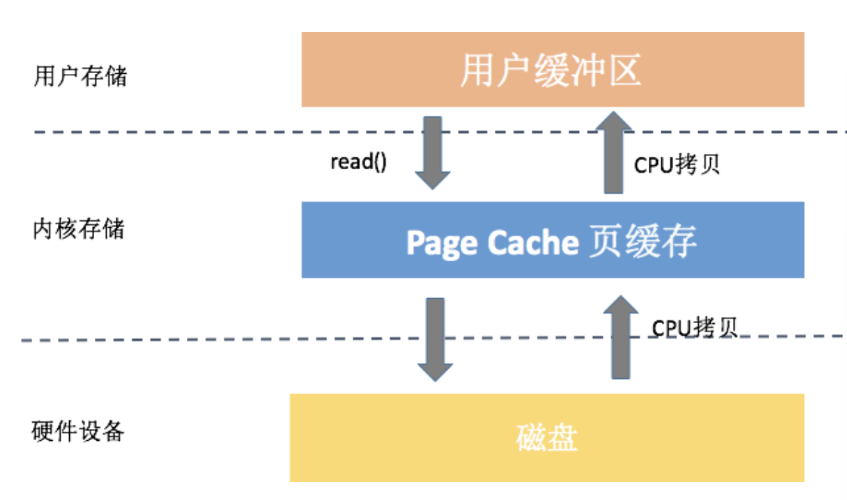
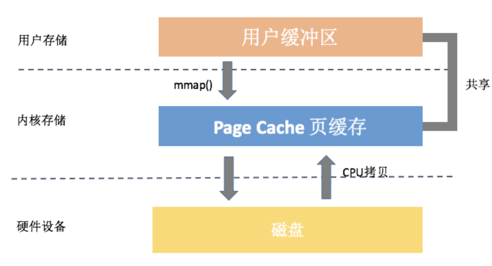
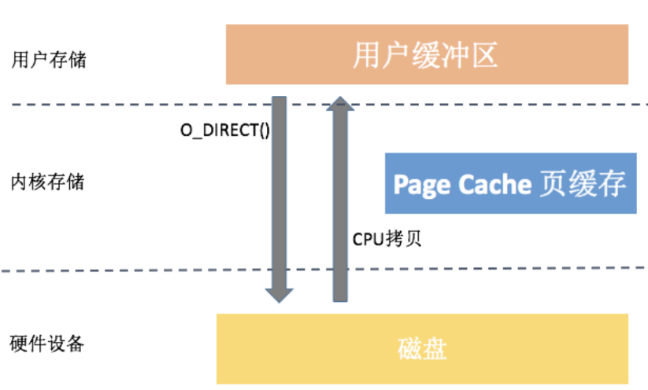

# 内存管理

linux 内核按页Page管理物理内存，每个用户进程拥有虚拟的完整连续内存地址空间，虚拟内存地址被内核处理后才会映射到实际物理内存上（映射关系维护在Page Table），（内核懒处理，只有虚拟地址被访问时才去给其分配物理内存）

vitrual memory page -page table mapping -> physical memory page

## 用户进程内存空间

【rss 和 vsz 区别】https://www.baeldung.com/linux/resident-set-vs-virtual-memory-size

进程内存中有哪些内容，首先肯定有

1. 可执行文件elf 的text段（可读 可执行） data段（可读可写） bss 段（在elf占用 少量空间，在内存占用 结构体实际所需空间， 匿名映射） 以及静态库、
2. 动态链接库文件的部分内容（libc.so）
3. 代码调用C标准库 （mallac）系统调用(brk ? mmap)等向内核 获取内存，这部分虚拟地址空间一般在heap区（匿名映射）
4. 线程函数调用栈，stack区，（匿名映射）
5. mmap区域   (映射文件)
6. kernel space

图示，进程高地址空间为内核空间，分配单位为页（4KB）

file-backend memory  ->page out, write back to file

anonymous memory -> swap out, swap file

private /shared   tmpfs shmem


进程的代码段、映射的文件都是file-backed，而进程的堆、栈都是不与文件相对应的、就属于匿名页。file-backed pages在内存不足的时候可以直接写回对应的硬盘文件里，称为page-out，不需要用到交换区(swap)；而anonymous pages在内存不足时就只能写到硬盘上的交换区(swap)里，称为swap-out。


**有用资料待整理**

**mmap file时，分配的内存属于page cache .**

**mmap file 过程 图示**[https://zhuanlan.zhihu.com/p/421298579](https://zhuanlan.zhihu.com/p/421298579)

内存与I/O的交换  水位（watermark）控制 https://cloud.tencent.com/developer/article/1404071


对于线程（非主线程）其地址空间是位于堆、栈之间的mmap区域，线程栈大小也是有限制的，默认2MB。栈空间里面，就是函数调用时生成的一系列栈帧。


一步一图带你深入理解 Linux 物理内存管理 [https://cloud.tencent.com/developer/article/2352771?areaId=106001](https://cloud.tencent.com/developer/article/2352771?areaId=106001)

## page cache

内核读写文件为了提升性能（主要特点是减少磁盘IO次数），使用了page cache，位于kernel space

（数据拷贝通过系统调用实现，涉及内核态和用户态互相转换，数据在内核空间和用户空间拷贝）

> linux kernel 最大程度利用可用内存当作 page cache使用，提升系统性能，当内存不够用会 尝试回收 reclaim这些 不活跃的 page cache
>
> swap被禁用前提下，container 申请 cgroup


### 读写文件场景page cache


1. buffered I/O

c 标准库read/write方法。内核从文件系统读取文件的部分内容到page cache中，再将应用程序所需内容复制到用户空间的内存上。

```c
#include<stdio.h>
int main(str ** args){

}
```



3. memory-mapped i/o

通过系统调用mmap将文件的page cache直接映射到用户进程内存空间 mmap区域，之后代码可像操作内存一样读写文件内容，避免频繁调用 read/write 系统调用。（减少了一次从kernel 到 user 区的数据拷贝）



3. direct i/o

内核直接把磁盘文件内容拷贝到用户空间，不使用PageCache



深入理解Linux 的Page Cache [51博客](https://www.51cto.com/article/680018.html?u_atoken=f8aa336b-121f-466e-9b97-32447d2feeea&u_asession=01VvGvM_mgIfKGk7YzwngBd9SWgC-ZwOBuzh4irjPP6KDGPfAy8FjJhGO_U_cFdDa_umXZXUhuow3987mvCOcZa9sq8AL43dpOnCClYrgFm6o&u_asig=05x317vaPyAtAs--bP9Ixy-ED7V44FnaqGOv4ZjX-epngDgsy97HUIyLtysTXZpzNSA4Jf0iSWcp_9euIK_0bMBG3r9JOS28frrlalja_zMvpfDMjS9qrawA-CAvNiIWt5q5wRqVC_hqGqgLO_pHc81mY8jVeYkL2ZBjide-0CpQcxp4L6obOvSXdbTyTKbxaQksmHjM0JOodanL5-M1Qs1XnufevwIilNorvyErtKFECut76cDcjGzPKXlSjHNv0LNF8RqEXr2lMzYPLggDvnHwbJMwghgaK_GXXAvEYXl2PY94r_LXIIil3Y3aVPRGAe&u_aref=OeIJW32ihoGfEevHJHFq84Dzw7g%3D)

iO 模式优缺点图解：buffered/mmap/direct-io [个人博客](https://blog.yorek.xyz/android/paid/master/io_2/)

tmpfs /shmem场景也使用了page cache，但是它不是file-backed，只能被swap out 到虚拟内存文件

### 其他场景使用了page cache

```
Page Cache = Buffers + Cached + SwapCached
Buffers + Cached + SwapCached = Active(file) + Inactive(file) + Shmem + SwapCached 
```

## page frame reclaim 内存回收

LRU算法 file page  / anonymous page-> inactive  lru 链表+ active lru链表

page cache 回收

file-backed  page-cache= active file + inactive file

**linux kernel 最大程度利用可用内存当作 page cache使用，提升系统性能**，当内存不够用会 尝试回收 reclaim这些 不活跃的 page cache

cgroup memory controller 发现内存不够用，尝试将 inactive file 丢弃或者写回磁盘，来释放内存给用户进程代码使用，若还是不够则触发oom

anonymous page 回收

写入swap file

## cgroup 内存子系统

cgroup 提供伪文件系统接口，通过对文件读写控制进程加入控制组，限制其内存资源

一般路径是/sys/fs/cgroup/memory/

docker 起的容器不使用宿主机根文件系统，所以 cache =0 ，直接使用cgroup 及宿主机tomcat 进程加入memory  hierary中

```bash
root@ubuntu20:~/docker# docker run -d  -p 8080:8080 tomcat:7.0.92-jre8
0a20759e5f3652c10708701c4f729d5c9ed7cabdd450dc9124ab6a05aee5a5c7
root@ubuntu20:~/docker# docker ps
CONTAINER ID   IMAGE                COMMAND             CREATED          STATUS          PORTS                                       NAMES
0a20759e5f36   tomcat:7.0.92-jre8   "catalina.sh run"   36 seconds ago   Up 35 seconds   0.0.0.0:8080->8080/tcp, :::8080->8080/tcp   suspicious_bose

root@ubuntu20:/sys/fs/cgroup/memory/docker/0a20759e5f3652c10708701c4f729d5c9ed7cabdd450dc9124ab6a05aee5a5c7# ll
total 0
drwxr-xr-x 2 root root 0 Dec  2 15:43 ./
drwxr-xr-x 4 root root 0 Dec  2 15:34 ../
-rw-r--r-- 1 root root 0 Dec  2 15:47 cgroup.clone_children
--w--w--w- 1 root root 0 Dec  2 15:43 cgroup.event_control
-rw-r--r-- 1 root root 0 Dec  2 15:43 cgroup.procs
-rw-r--r-- 1 root root 0 Dec  2 15:47 memory.failcnt
--w------- 1 root root 0 Dec  2 15:47 memory.force_empty
-rw-r--r-- 1 root root 0 Dec  2 15:47 memory.kmem.failcnt
-rw-r--r-- 1 root root 0 Dec  2 15:47 memory.kmem.limit_in_bytes
-rw-r--r-- 1 root root 0 Dec  2 15:47 memory.kmem.max_usage_in_bytes
-r--r--r-- 1 root root 0 Dec  2 15:47 memory.kmem.slabinfo
-rw-r--r-- 1 root root 0 Dec  2 15:47 memory.kmem.tcp.failcnt
-rw-r--r-- 1 root root 0 Dec  2 15:47 memory.kmem.tcp.limit_in_bytes
-rw-r--r-- 1 root root 0 Dec  2 15:47 memory.kmem.tcp.max_usage_in_bytes
-r--r--r-- 1 root root 0 Dec  2 15:47 memory.kmem.tcp.usage_in_bytes
-r--r--r-- 1 root root 0 Dec  2 15:47 memory.kmem.usage_in_bytes
-rw-r--r-- 1 root root 0 Dec  2 15:47 memory.limit_in_bytes
-rw-r--r-- 1 root root 0 Dec  2 15:47 memory.max_usage_in_bytes
-rw-r--r-- 1 root root 0 Dec  2 15:47 memory.move_charge_at_immigrate
-r--r--r-- 1 root root 0 Dec  2 15:47 memory.numa_stat
-rw-r--r-- 1 root root 0 Dec  2 15:43 memory.oom_control
---------- 1 root root 0 Dec  2 15:47 memory.pressure_level
-rw-r--r-- 1 root root 0 Dec  2 15:47 memory.soft_limit_in_bytes
-r--r--r-- 1 root root 0 Dec  2 15:47 memory.stat
-rw-r--r-- 1 root root 0 Dec  2 15:47 memory.swappiness
-r--r--r-- 1 root root 0 Dec  2 15:47 memory.usage_in_bytes
-rw-r--r-- 1 root root 0 Dec  2 15:47 memory.use_hierarchy
-rw-r--r-- 1 root root 0 Dec  2 15:47 notify_on_release
-rw-r--r-- 1 root root 0 Dec  2 15:47 tasks
```

### memory.stat

```bash
root@ubuntu20:/sys/fs/cgroup/memory/docker/0a20759e5f3652c10708701c4f729d5c9ed7cabdd450dc9124ab6a05aee5a5c7# cat memory.stat 
cache 0
rss 188542976
rss_huge 0
shmem 0
mapped_file 0
dirty 0
writeback 0
pgpgin 60159
pgpgout 14093
pgfault 61644
pgmajfault 0
inactive_anon 0
active_anon 188694528
inactive_file 0
active_file 0
unevictable 0
hierarchical_memory_limit 9223372036854771712
total_cache 0
total_rss 188542976
total_rss_huge 0
total_shmem 0
total_mapped_file 0
total_dirty 0
total_writeback 0
total_pgpgin 60159
total_pgpgout 14093
total_pgfault 61644
total_pgmajfault 0
total_inactive_anon 0
total_active_anon 188694528
total_inactive_file 0
total_active_file 0
total_unevictable 0
```

| field         | kernel desc                                                                  | remark                          |
| ------------- | ---------------------------------------------------------------------------- | ------------------------------- |
| cache         | of bytes of page cache memory                                                |                                 |
| rss           | of bytes of anonymous and swap cache memory (includes transparent hugepages) | 只包含匿名映射内存 虚拟交换内存 |
| mapped_file   | of bytes of mapped file (includes tmpfs/shmem)                               |                                 |
| swap          |                                                                              |                                 |
| inactive_anon | of bytes of anonymous and swap cache memory on inactive LRU list.           |                                 |
| active_anon   | of bytes of anonymous and swap cache memory on active	LRU list               |                                 |
| inactive_file | of bytes of file-backed memory on inactive LRU list.                         |                                 |
| active_file   | of bytes of file-backed memory on active LRU list.                           |                                 |
| unevictable   | of bytes of memory that cannot be reclaimed (mlocked etc)                    |                                 |

不使用swap前提下：


rss+mapped_file 才是控制组实际的rss。另外file 和shmem 的page cache 只统计到first touch的cgroup里面。

Only anonymous and swap cache memory is listed as part of 'rss' stat.This should not be confused with the true 'resident set size' or the amount of physical memory used by the cgroup.'rss + mapped_file" will give you resident set size of cgroup.(Note: file and shmem may be shared among other cgroups. In that case,mapped_file is accounted only when the memory cgroup is owner of page cache.)

## Linux 内存有关

[参考](https://www.cnblogs.com/xuxinkun/p/5541894.html)

内核通过/proc/meminfo文件展示系统内存信息 [每个指标的意义](https://superuser.com/questions/521551/cat-proc-meminfo-what-do-all-those-numbers-mean/521552#521552)

> 查看命令 `cat /proc/meminfo`

- Mapped — The total amount of memory, in kilobytes, which have been used to map devices, files, or libraries using the `mmap` command.
- Slab — The total amount of memory, in kilobytes, used by the kernel to cache data structures for its own use.

free 命令基于上述文件，统计了常用的指标值：

- mem: 物理内存
- swap: 虚拟内存。即可以把数据存放在硬盘上的数据
- shared: 共享内存。存在于物理内存中。
- buffers: 用于存放要输出到disk（块设备）的数据的
- cached: 存放从disk上读出的数据

1.shared 共享内存

主要用于进程之间交互，tmpfs 基于内存的文件系统？

2.swap

什么时候会触发进程内存被swapped

http://hustcat.github.io/memory-usage-in-process-and-cgroup/?spm=a2c6h.12873639.article-detail.6.4db57092ht3czS

**等待合并到上面内容中**

## 进程内存

【rss 和 vsz 区别】https://www.baeldung.com/linux/resident-set-vs-virtual-memory-size

【Linux中进程内存与cgroup内存的统计】http://hustcat.github.io/memory-usage-in-process-and-cgroup/?spm=a2c6h.12873639.article-detail.6.4db57092ht3czS

### RSS(Resident set size)

> The *RSS* (Resident Set Size) is the amount of memory usage that is present in RAM. But modern operating systems rely heavily on shared memory. If two processes use the same system library, then the system library's memory usage is shared between those processes. However, the shared memory still shows up in the RSS metric, making you believe that actual memory usage is higher than it actually is. The RSS also does not include memory that the OS has written away from swap, so it may also lead you to believe that memory usage is lower than what it actually is.

进程s实际使用的物理内存大小（包括共用的动态库所占用的内存空间）

1. 是否包括内核中 buffer cached? 不包括。
2. 内存被swap后，不统计，不位于物理内存当中
3. 匿名内存是什么？

- （1）用户空间的匿名映射页（Anonymous pages in User Mode address spaces），比如调用malloc分配的内存，以及使用MAP_ANONYMOUS的mmap；当系统内存不够时，内核可以将这部分内存交换出去；
- （2）用户空间的文件映射页（Mapped pages in User Mode address spaces），包含map file和map tmpfs；前者比如指定文件的mmap，后者比如IPC共享内存；当系统内存不够时，内核可以回收这些页，但回收之前可能需要与文件同步数据；
- （3）文件缓存（page in page cache of disk file）；发生在程序通过普通的read/write读写文件时，当系统内存不够时，内核可以回收这些页，但回收之前可能需要与文件同步数据；
- （4）buffer pages，属于page cache；比如读取块设备文件。

其中（1）和（2）是算作进程的RSS，mmap文件时基于page cache，这类page cache 被统计到RSS当中了。

（3)和（4)属于page cache。

### VSZ (Virtual Memory Size)

> This is a measure of much memory a process can access after its execution.
> This includes swapped memory, the memory from external libraries, and allocated memory that’s not used.
> Most modern Linux-based OSes utilize demand paging which means they only bring pages into memory once a program attempts to use them.

### PS命令

```bash
$ ps aux

USER         PID %CPU %MEM    VSZ   RSS TTY      STAT START   TIME COMMAND
root        9326  0.0  0.0  25340  6560 ?        S    22:17   0:00 /lib/systemd/
root        9327  0.0  0.0  25340  6624 ?        S    22:17   0:00 /lib/systemd/
robert      9330  1.2  0.0  13408  5248 pts/0    Ss   22:17   0:00 bash
robert      9367  0.0  0.0  14024  3428 pts/0    R+   22:17   0:00 ps aux
```

Let’s break down our command to understand what every flag represents:

- ***a** –* displays processes from all users
- ***u** –* displays the specific user of each process
- ***x*** – displays all processes not attached to a terminal, these include services such as *crond* or *upowerd*

这里统计的是页数？ 再乘以PageSize 4KB 才是实际值？

## Docker/ cgroups 内存

见 **容器技术.md**

## JVM 内存

见 **jvm.md**
