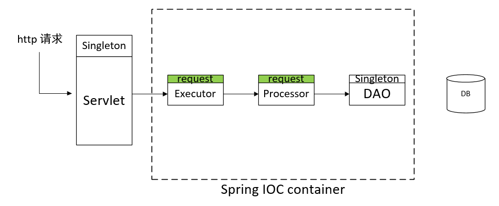
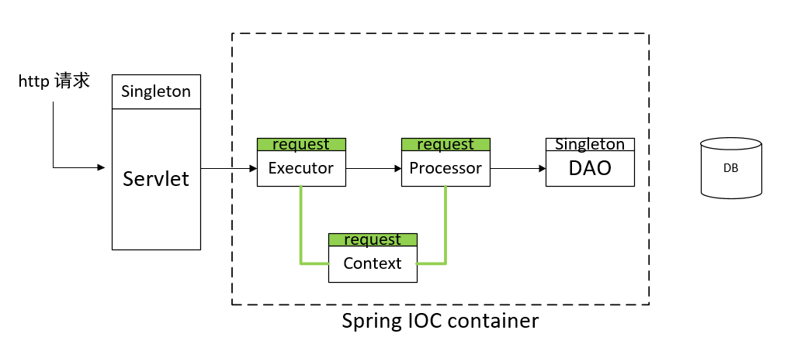

## request-scoped spring bean使用场景

我们组内应用采用 tomcat(独立部署)+公司自研Servlet+Spring构建。我们的服务不提供MVC中的View（视图），可以理解为Restful 服务。

我们组内大量使用 scope类型为Request的spring bean（即request-scoped spring bean）处理业务逻辑。简易模型如图所示,调用关系大致是 servlet ->executor->processor->dao。其中servlet实例生命周期与应用一致，可以看作是“singleton”类型。然后包含业务逻辑代码的executor, processor bean 作用域是request类型，处理数据持久化的Dao bean的作用域为“singleton”。

一开始我也不理解为啥使用 request scope，是为了保证线程安全吗？如果 executor processor 内部是有状态的，那每来一个http 请求，我们为它生产专属的bean，确实可以保证每个请求之间互不干扰，不影响各自的状态，这是request scope bean的明显优点。但是这样同时带来一些劣势，那就是 spring ioc container 会频繁地实例化对象，并在请求处理完后（一小段时间）释放对象，导致大量生命周期极短的bean出现，可以导致gc 频繁工作，给请求的响应时间带来负影响。

与组长交流后，得知request scope所带来线程安全不是他们考虑使用request-scoped bean构建应用的主要原因， 真正的原因是利用 request scope的特点，让spring ioc container为每个请求构建一个独立的context 上下文。下图展示更完整点的模型图。

该图与上图主要区别是多了一个 request-scoped bean，Context。可以先简单认为是一个Map对象，可以存放键值对，我们在这里存放所有跟这次 http请求有关的上下文信息，比如本次被调用的方法名称、客户端的服务名，ip地址、一些请求头metadata数据。

我们让所有Request scoped的业务bean都必须依赖一个context bean。如何让框架实现？可以让所有业务bean 继承同一个父类，该父类存在一个field，类型为 Context，并使用@Autowired标记，业务bean被实例化时，spring自动注入父类需要的依赖即Context bean，这样一个HTTP请求所属的业务bean 都依赖同一个Context  bean。那就可以有如下好处，

（1）方便设置日志全局tag。所有业务bean使用 context提供的日志实例打日志，我们可以在一开始处理请求时将订单号 url等信息存入context中，则所有业务bean 打日志时，logger实例每次都可以讲这些全局tag 携带上提交日志消息。在日志查询系统中可以根据这些tag 去找某个url或者某个订单的请求处理链路。

（目前我最大感受是来自打日志非常方便，有很多好处，我没法完整描述出来。比如不用我手写代码从日志工厂获取logger实例，设置全局标签非常优雅）

（2）我们可以业务bean的处理结果放入context中，后面其他业务bean可以直接从context拿到结果，给不同bean提供了交换信息的通道。

。。。额 很多好处没有完全说出来，语言表达能力捉急。

可能有人会想借助ThreadLocal 也可以为HTTP 请求创建一个context，并且所有业务bean都可以是单例，毕竟一个http 请求是在一个线程内完成的，threadlocal可以创造 线程级别的Context，那就等同于 http 请求 context。与 使用request scope构建 http 请求上下文相比，它可能有如下劣势，毕竟线程是复用的，每次新请求来时需要有一个干净的上下文，这需要我们手动在处理完上一次请求处理时（或者处理这次请求的开头） 主动clear 之前的context，而request scope 构建的context由 spring ioc container 来进行释放。