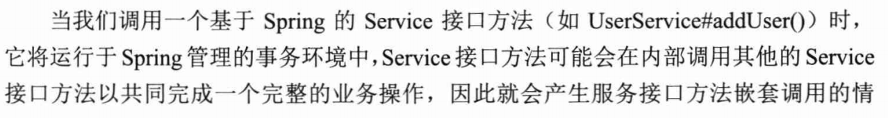
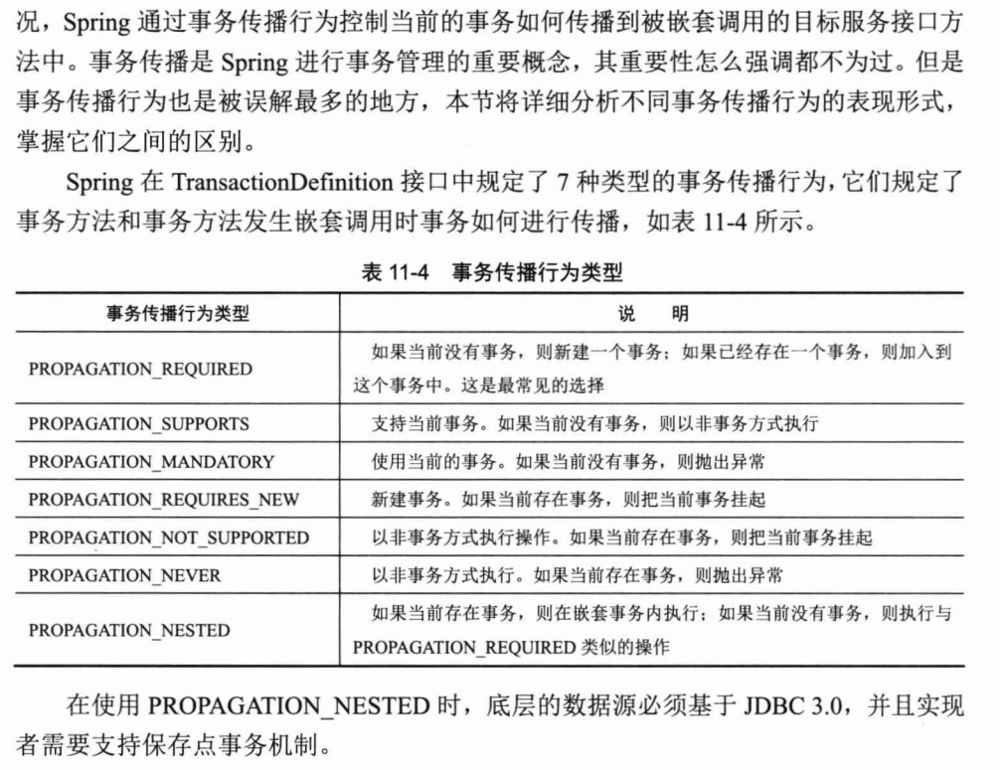
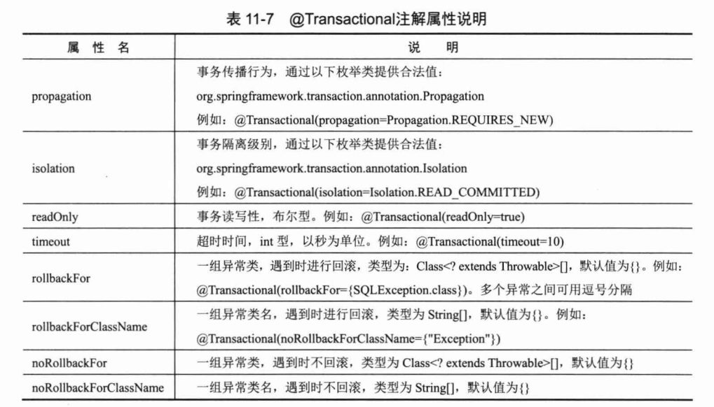
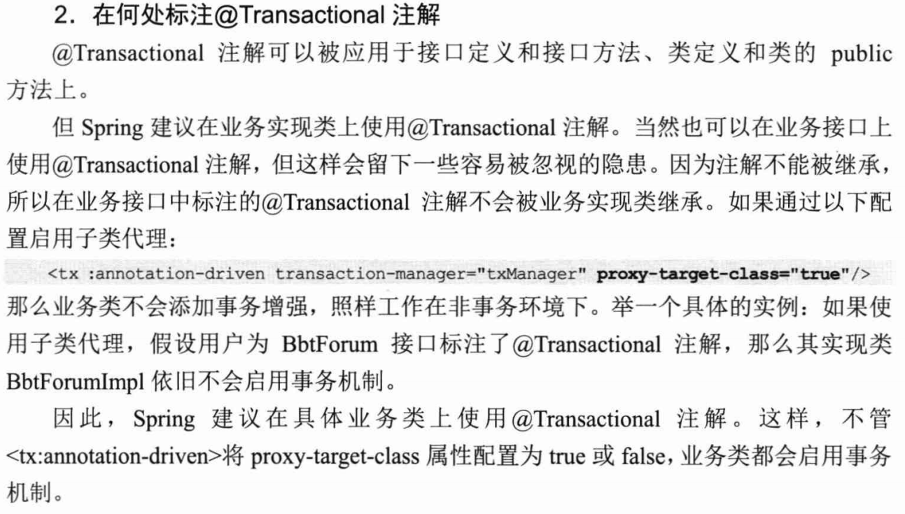

Application  refresh 流程中，refreshBeanFactory（） 内部BeanFactory状态

```xml
<?xml version="1.0" encoding="UTF-8"?>
<beans xmlns="http://www.springframework.org/schema/beans"
       xmlns:xsi="http://www.w3.org/2001/XMLSchema-instance"
       xmlns:context="http://www.springframework.org/schema/context"
       xsi:schemaLocation="http://www.springframework.org/schema/beans http://www.springframework.org/schema/beans/spring-beans.xsd http://www.springframework.org/schema/context https://www.springframework.org/schema/context/spring-context.xsd">
    <context:annotation-config/>
    <bean class="com.alan.spring.Student" name="student"/>
    <bean class="com.alan.spring.Bicycle" name="bicycle">
       <property name="brand" value="phoenix"/>
    </bean>

</beans>

```


```java
org.springframework.context.annotation.internalConfigurationAnnotationProcessor -> {RootBeanDefinition@1832} "Root bean: class [org.springframework.context.annotation.ConfigurationClassPostProcessor]; scope=; abstract=false; lazyInit=false; autowireMode=0; dependencyCheck=0; autowireCandidate=true; primary=false; factoryBeanName=null; factoryMethodName=null; initMethodName=null; destroyMethodName=null"

org.springframework.context.annotation.internalAutowiredAnnotationProcessor -> {RootBeanDefinition@1838} "Root bean: class [org.springframework.beans.factory.annotation.AutowiredAnnotationBeanPostProcessor]; scope=; abstract=false; lazyInit=false; autowireMode=0; dependencyCheck=0; autowireCandidate=true; primary=false; factoryBeanName=null; factoryMethodName=null; initMethodName=null; destroyMethodName=null"
    
org.springframework.context.annotation.internalCommonAnnotationProcessor -> {RootBeanDefinition@1840} "Root bean: class [org.springframework.context.annotation.CommonAnnotationBeanPostProcessor]; scope=; abstract=false; lazyInit=false; autowireMode=0; dependencyCheck=0; autowireCandidate=true; primary=false; factoryBeanName=null; factoryMethodName=null; initMethodName=null; destroyMethodName=null"

org.springframework.context.annotation.internalRequiredAnnotationProcessor -> {RootBeanDefinition@1842} "Root bean: class [org.springframework.beans.factory.annotation.RequiredAnnotationBeanPostProcessor]; scope=; abstract=false; lazyInit=false; autowireMode=0; dependencyCheck=0; autowireCandidate=true; primary=false; factoryBeanName=null; factoryMethodName=null; initMethodName=null; destroyMethodName=null"
    
    
 org.springframework.context.event.internalEventListenerFactory -> {RootBeanDefinition@1834} "Root bean: class [org.springframework.context.event.DefaultEventListenerFactory]; scope=; abstract=false; lazyInit=false; autowireMode=0; dependencyCheck=0; autowireCandidate=true; primary=false; factoryBeanName=null; factoryMethodName=null; initMethodName=null; destroyMethodName=null"
    
 org.springframework.context.event.internalEventListenerProcessor -> {RootBeanDefinition@1836} "Root bean: class [org.springframework.context.event.EventListenerMethodProcessor]; scope=; abstract=false; lazyInit=false; autowireMode=0; dependencyCheck=0; autowireCandidate=true; primary=false; factoryBeanName=null; factoryMethodName=null; initMethodName=null; destroyMethodName=null"
```


# 常用注解

>注意 注解类属性大部分都有默认值，如果一个注解只有一个属性且属性名为value，使用时可直接指定值

## 自动装配有关

**1. @Component("beanName")**  

 //只有一个value属性,String 指定bean 名称 

生成bean名称规则：

* 取短类名，即不包含包路径的类名，例如com.test.Student的短类名为Student，这点跟XML配置中取全类名不一样

* 如果短类名长度大于1，且第一个和第二个字符为大写，则直接返回短类名，也就是说假设类为com.test.STudent，则beanName为STudent

* 其他情况下将短类名首字符小写后返回，假设类为com.test.Student，则beanName为student

**2. @Autowired(required=false)** 

默认按照类型装配 如果该依赖不存在，跳过，不报错 

@Primary 

@Autowired 首先使用该bean提供依赖

@Qualifier(value=" ") //指定使用哪个bean

@Resource（name=" "）该属性不能为空

 @Resource **是JDK1.6支持的注解**，**默认按照名称进行装配**，名称可以通过name属性进行指定，如果没有指定name属性，当注解写在字段上时，默认取字段名，按照名称查找，如果注解写在setter方法上默认取属性名进行装配。当找不到与名称匹配的bean时才按照类型进行装配。但是需要注意的是，如果name属性一旦指定，就只会按照名称进行装配。

## Java 类配置有关

@Configuration("  ")

该注解类被@Component 标记，属性值指定spring bean名称（部分情况下）

@Bean（name=" ", 一堆其他属性）

## SpringMVC 有关

### @RequestMapping

| 属性           | 意义                                                         |
| -------------- | ------------------------------------------------------------ |
| value (method) | 指定请求的URL                                                |
| method         | 指定http方法类型，get,post,put,delete等                      |
| consumes       | 指定处理请求的提交内容类型（Content-Type），例如application/json, text/html |
| produces       | 指定返回的内容类型，仅当request请求头中的(Accept)类型中包含该指定类型才返回； |
| params         | 指定request中必须包含某些参数值时，才让该方法处理。          |
| headers        | 指定request中必须包含某些指定的header值，才能让该方法处理请求。 |

# IOC 控制反转

1. 什么是ioc 控制反转(有关问题答案需要重新整理)
    之前我们自己实例化对象，并设置属性的依赖，现在将控制权转交给spring ioc。以xml文件配置方式为例，只需要在xml文件配置我们需要的对象并指定他们的依赖，spring 会帮助我们生成、装配这些对象bean，这种方式集中管理了所有bean的生成和依赖，非常高效。只需要修改xml文件就可以修改对象的依赖。

2. 核心接口
    BeanFactory

  ApplicationContext

  WebApplicatinContext

3. spring bean 默认是单例模式，使用getBean() 获取的是同一个对象

4. bean的id 在ioc容器中必须唯一

5. spring 如何解决互相依赖的两个对象的创建（循环依赖问题），先用默认构造器创建，然后通过属性注入依赖

6. bean作用域
    默认是singleton 单例模式，
    prototype 每次调用getBean() 获取新的对象 ，自动装配模式下 通过@Scope（“prototype”）设置
    @Qualifier("beanId") 指定使用哪个bean
## IOC注入方式

1. 构造器注入
2. 属性注入
3. 工厂方法注入

## 组件 接口 API

### FactoryBean 工厂bean

>自定义Bean实例化逻辑

https://www.guitu18.com/post/2019/04/28/33.html

1. 工厂Bean跟普通Bean不同，其返回的对象不是指定类的一个实例，spring ioc容器接收该FactoryBean的getObject方法所返回的对象。
2. 以Bean结尾，表示它是一个Bean，不同于普通Bean的是：它是实现了FactoryBean<T>接口的Bean，根据该Bean的ID从BeanFactory中获取的实际上是FactoryBean的getObject()返回的对象，而不是FactoryBean本身，如果要获取FactoryBean对象，请在id前面加一个&符号来获取。

```java
public interface FactoryBean<T> {
    T getObject() throws Exception;

    Class<?> getObjectType();

    boolean isSingleton();
}
```


# AOP 面向切面编程

参考资料：
[1]: https://juejin.im/post/5b06bf2df265da0de2574ee1

## AOP思想简介

面向切面编程，是对oop的补充，适合特定应用场合，只适合具有横切逻辑的应用场合，比如性能监测、访问控制、事务管理及日志记录。AOP把不同业务类中重复的横切逻辑代码 横向抽取出去，进行独立开发维护，通过动态代理技术将重复代码织入目标对象方法中，实现和原来同样的功能。通过oop的纵向抽象和aop的横向抽取，才能正在解决程序的重新性代码问题。

> **将相同逻辑的重复代码横向抽取出来，使用动态代理技术将这些重复代码织入到目标对象方法中，实现和原来一样的功能**。


##  Spring AOP简介

> Spring AOP 只对方法进行了增强


## AOP基本术语

连接点 Joinpoint
切点 Pointcut
增强（通知）Advice
引介 Introduction
织入 Weaving
切面 Aspect
目标类 target
代理类 Proxy 

## JDK 动态代理 CGLib代理

1. 静态代理 vs 动态代理

   ​    代理模式是常用的Java设计模式，它的特征是代理类与委托类有同样的接口，代理类主要负责为委托类预处理消息、过滤消息、把消息转发给委托类，以及事后处理消息等。代理类与委托类之间通常会存在关联关系，一个代理类的对象与一个委托类的对象关联，代理类的对象本身并不真正实现服务，而是通过调用委托类的对象的相关方法，来提供特定的服务。按照代理类的创建时期，代理类可分为两种。

   静态代理类：由程序员创建或由特定工具自动生成源代码，再对其编译。在程序运行前，代理类的.class文件就已经存在了。
   动态代理类：在程序运行时，运用反射机制动态创建而成。
   静态代理通常只代理一个类，动态代理是代理一个接口下的多个实现类。
    静态代理事先知道要代理的是什么，而动态代理不知道要代理什么东西，只有在运行时才知道。
   动态代理是实现JDK里的InvocationHandler接口的invoke方法，但注意的是代理的是接口，也就是你的业务类必须要实现接口，通过Proxy里的newProxyInstance得到代理对象。
   还有一种动态代理CGLIB，代理的是类，不需要业务类继承接口，通过派生的子类来实现代理。通过在运行时，动态修改字节码达到修改类的目的。


# Spring 日志框架
1. spring框架 （不是spring boot）默认使用commons-logging 作为日志门面库，在HelloSpring工程修改使用slf4j-log4j2组合。[参考博客](https://www.jianshu.com/p/da1c9e1e13ea)


# Spring MVC


### 处理请求流程


行实际的处理。 在Spring MVC中， DispatcherServlet就是前端控制器。 


### 涉及的主要类

* DispatcherServlet

* HandlerMapping
* Controller
* HandlerAdapter
* ViewResolver

### SpringMVC 中容器

> 参考资料
> [https://www.cnblogs.com/brolanda/p/4265597.html](https://www.cnblogs.com/brolanda/p/4265597.html)
> 基于Spring MVC的Web项目内部使用两个Spring IOC容器（WebApplicationContext），这里分析两个容器如何被启动及其之间关系，以及如何使用。

### root容器

启动方式：Spring提供了实现ServletContextListener接口的上下文初始化监听器org.springframework.web.context.ContextLoaderListener，在web.xml文件声明该监听器，并且通过<context-param>指定spring配置文件路径。该监听器在servletContext初始化后被调用，内部从servletContext获取配置文件，初始化根IOC容器。并将IOC容器的引用存在到servletContext的 属性当中。
```
<context-param>
    <param-name>contextConfigLocation</param-name>
    <param-value>/WEB-INF/applicationContext.xml,/WEB-INF/action-servlet.xml,/WEB-INF/jason-servlet.xml</param-value>
</context-param>
<listener>
    <listener-class>org.springframework.web.context.ContextLoaderListener</listener-class>
</listener>
```
root 容器一般创建、管理sevice 层、DAO层、 dataSource等Bean，用于全局共享。每个servlet 的独自 IOC容器将其作为父容器，可使用其中的bean。


### 子容器
SpringMVC DispatchServlet内部会初始化自己的IOC 容器，并从ServletContext处获取全局的IOC容器，将其作为自己的父容器，子容器的配置文件在<servlet>标签内部通过<init-param>指定。一般在springMVC-context.xml 装配controller 层的bean。
```xml
  <servlet>
    <servlet-name>springMVC</servlet-name>
    <servlet-class>org.springframework.web.servlet.DispatcherServlet</servlet-class>
    <!--    指定DispatcherServlet 上下文配置-->
    <!--    如果不手工指定配置文件，默认加载 servletName-context.xml文件-->
    <init-param>
      <!--Sources标注的文件夹下需要新建一个spring文件夹-->
      <param-name>contextConfigLocation</param-name>
      <param-value>classpath:/spring/spring-mvc.xml</param-value>
    </init-param>
    <load-on-startup>1</load-on-startup>
    <async-supported>true</async-supported>
  </servlet>
```

### 常见类

1.  RequestContextHolder 可用于获取当前线程正在处理的HttpServletRequest ?

https://zhuanlan.zhihu.com/p/24293062

2. HandlerInterceptorAdapter(抽象类，实现了接口HandlerInterceptor )

3. @ControllerAdvice + @ExceptionHandler 全局处理 Controller 层异常

   https://blog.csdn.net/kinginblue/article/details/70186586

@Validated(Update.class) @RequestBody 数据检验


# Spring JDBC 事务

### 事务传播行为





### 声明式事务

1. 配置流程

   定义事务同步管理器（spring boot 项目已默认配置好了？）

2. @Transactional 注解 

   




# Spring WEB

## SpringMVC 组件

### Controller方法入参自动封装器

>https://juejin.im/post/5d6614756fb9a06b1b19d12e

```
HandlerMethodArgumentResolver
```

策略接口：用于在**给定请求的上下文中**将方法参数解析为参数值。简单的理解为：它负责处理你`Handler`方法里的**所有入参**：包括自动封装、自动赋值、校验等等。有了它才能会让`Spring MVC`处理入参显得那么高级、那么自动化。`Spring MVC`内置了非常非常多的实现，当然若还不能满足你的需求，你依旧可以自定义和自己注册，后面我会给出自定义的示例。

有个形象的公式：`HandlerMethodArgumentResolver = HandlerMethod + Argument(参数) + Resolver(解析器)`。解释为：它是`HandlerMethod`方法的解析器，将`HttpServletRequest(header + body 中的内容)`解析为`HandlerMethod`方法的参数（method parameters）

// @since 3.1   HandlerMethod 方法中 参数解析器
public interface HandlerMethodArgumentResolver {

```java
// 判断 HandlerMethodArgumentResolver 是否支持 MethodParameter
// (PS: 一般都是通过 参数上面的注解|参数的类型)
boolean supportsParameter(MethodParameter parameter);

// 从NativeWebRequest中获取数据，ModelAndViewContainer用来提供访问Model
// MethodParameter parameter：请求参数
// WebDataBinderFactory用于创建一个WebDataBinder用于数据绑定、校验
@Nullable
Object resolveArgument(MethodParameter parameter, @Nullable ModelAndViewContainer mavContainer, NativeWebRequest webRequest, @Nullable WebDataBinderFactory binderFactory) throws Exception;
}
```


## 数据校验

### Controller方法入参自动封装器

内部集成数据校验代码

### JSR 303 /Hibernate Validator

1. maven依赖

   ```xml
   <dependency>
       <groupId>org.hibernate</groupId>
       <artifactId>hibernate-validator</artifactId>
       <version>5.4.0.Final</version>
   </dependency>
   
   <dependency>
       <groupId>javax.el</groupId>
       <artifactId>el-api</artifactId>
       <version>2.2</version>
   </dependency>
   <dependency>
       <groupId>org.glassfish.web</groupId>
       <artifactId>javax.el</artifactId>
       <version>2.2.4</version>
   </dependency>
   ```

2. Bean Validation 中内置的 constraint

| Constraint                  |                         详细信息                         |
| :-------------------------- | :------------------------------------------------------: |
| @Null                       |                 被注释的元素必须为 null                  |
| @NotNull                    |                被注释的元素必须不为 null                 |
| @AssertTrue                 |                 被注释的元素必须为 true                  |
| @AssertFalse                |                 被注释的元素必须为 false                 |
| @Min(value)                 | 被注释的元素必须是一个数字，其值必须大于等于指定的最小值 |
| @Max(value)                 | 被注释的元素必须是一个数字，其值必须小于等于指定的最大值 |
| @DecimalMin(value)          | 被注释的元素必须是一个数字，其值必须大于等于指定的最小值 |
| @DecimalMax(value)          | 被注释的元素必须是一个数字，其值必须小于等于指定的最大值 |
| @Size(max, min)             |           被注释的元素的大小必须在指定的范围内           |
| @Digits (integer, fraction) |   被注释的元素必须是一个数字，其值必须在可接受的范围内   |
| @Past                       |             被注释的元素必须是一个过去的日期             |
| @Future                     |             被注释的元素必须是一个将来的日期             |
| @Pattern(value)             |           被注释的元素必须符合指定的正则表达式           |

3. Hibernate Validator 附加的 constraint

| Constraint |                详细信息                |
| :--------- | :------------------------------------: |
| @Email     |     被注释的元素必须是电子邮箱地址     |
| @Length    | 被注释的字符串的大小必须在指定的范围内 |
| @NotEmpty  |        被注释的字符串的必须非空        |
| @Range     |     被注释的元素必须在合适的范围内     |

4. **自定义约束**

   如何实现

## 会话管理 

### 容器级Session 基于HttpSession cookie

### 分布式Session 基于Redis cookie 


## 权限控制


## 缓存 cache


## 任务调度与异步执行器

### Quartz

>最新版本的quartz 执行任务出现运行错误时，不会通过默认的异常处理器 在terminal中打印异常信息 及方法调用栈，而是同伙日志框架打印这些信息，如果quartz 的日志框架未正常工作，则出现bug 很难定位问题。

### 核心概念

1. Job 

   表示一个工作，要执行的具体内容。此接口中只有一个方法，如下：

   ```
   void execute(JobExecutionContext context) 
   ```

2. **JobDetail** 表示一个具体的可执行的调度程序，Job 是这个可执行程调度程序所要执行的内容，另外 JobDetail 还包含了这个任务调度的方案和策略。

3. **Trigger** 代表一个调度参数的配置，什么时候去调。

4. **Scheduler** 代表一个调度容器，一个调度容器中可以注册多个 JobDetail 和 Trigger。当 Trigger 与 JobDetail 组合，就可以被 Scheduler 容器调度了。


## 消息队列

## 日志框架

> 开发Java应用程序时需要使用各种开源组件帮助我们实现程序功能。比较庞大的开源组件会使用第三方日志框架记录日志、打印调试信息，现在开源组件大多选用slf4j库，把真正的日志框架选择权交给应用程序开发人员，如何使slf4j 与实际使用的日志框架成功桥接，成为比较麻烦的地方。每个日志实现框架与slf4j桥接库不同，slf4j 的不同版本与 log4j 2工作需要使用不同pom依赖

### slf4j

The Simple Logging Facade for Java (SLF4J) serves as a simple facade or abstraction for various logging frameworks (e.g. java.util.logging, logback, log4j) allowing the end user to plug in the desired logging framework at *deployment* time.

```java
final Logger logger = LoggerFactory.getLogger(Wombat.class);
logger.debug("Temperature set to {}. Old temperature was {}.", t, oldT);
logger.info("Temperature has risen above 50 degrees.");
```


**当slf4j无法绑定任何一个日志实现框架时，会采用 NOP logger,该logger不会打印任何信息，应用通过日志打印的错误信息无法被暴露出来、发现，导致无法调试代码，快速定位代码错误问题**

使用手册：http://www.slf4j.org/manual.html


### log4j 2

log4j有1.x（不在维护）、2.x两个版本，对应的POM 依赖名字完全不同，不只是\<version>值不同，注意区别。2.x POM依赖如下：

```xml
<dependency>  
    <groupId>org.apache.logging.log4j</groupId>  
    <artifactId>log4j-api</artifactId>  
    <version>2.12.1</version>
</dependency>
<dependency>  
    <groupId>org.apache.logging.log4j</groupId>  
    <artifactId>log4j-core</artifactId>  
    <version>2.12.1</version>
</dependency>
```

```java
private static final Logger logger = LogManager.getLogger(AppProducer.class);
logger.error(" parse failed: producer.propeties.");
```


log4j 2 提供如下依赖用于适配slf4j 

 Log4j 2 SLF4J Binding

The Log4j 2 SLF4J Binding allows applications coded to the SLF4J API to use Log4j 2 as the implementation.

Due to a break in compatibility in the SLF4J binding, as of release 2.11.1 two SLF4J to Log4j Adapters are provided.

1. log4j-slf4j-impl should be used with SLF4J 1.7.x releases or older.
2. log4j-slf4j18-impl should be used with SLF4J 1.8.x releases or newer.

Applications that take advantage of the Java Module System should use SLF4J 1.8.x and log4j-slf4j18-impl.

Requirements

The Log4j 2 SLF4J Binding has a dependency on the Log4j 2 API as well as the SLF4J API. For more information, see [Runtime Dependencies](https://logging.apache.org/log4j/2.x/runtime-dependencies.html).

Usage

The SLF4J binding provided in this component cause all the SLF4J APIs to be routed to Log4j 2. Simply include the Log4j 2 SLF4J Binding jar along with the Log4j 2 jars and SLF4J API jar to cause all SLF4J logging to be handled by Log4j 2.

Use of the Log4j 2 SLF4J Binding (log4j-slf4j-impl-2.0.jar) together with the SLF4J adapter (log4j-to-slf4j-2.0.jar) should never be attempted, as it will cause events to endlessly be routed between SLF4J and Log4j 2.

### logback

## cookie 

### 基础

cookie由客户端维护，从HttpServletRequest中获取客户端发送的cookie。通过HttpServletResponse添加cookie。cookie 主要属性包括 cookie名称、cookie值、maxAge(生命周期)、Path(路径，猜测是客户端请求的uri属于该路径，则请求需携带该cookie)。

在会话管理情景下，如果客户端请求一直活动，如何重置对应cookie生命周期。


## 压测工具

### Jmeter

Don't use GUI mode for load testing !, only for Test creation and Test debugging.
For load testing, use CLI Mode (was NON GUI):
   jmeter -n -t [jmx file] -l [results file] -e -o [Path to web report folder]
& increase Java Heap to meet your test requirements:
   Modify current env variable HEAP="-Xms1g -Xmx1g -XX:MaxMetaspaceSize=256m" in the jmeter batch file
Check : https://jmeter.apache.org/usermanual/best-practices.html

## Restful 服务

