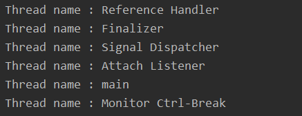
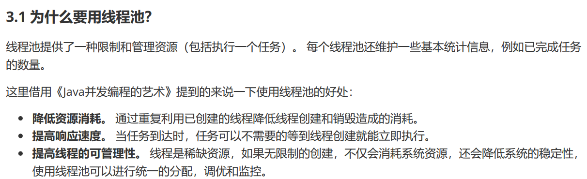
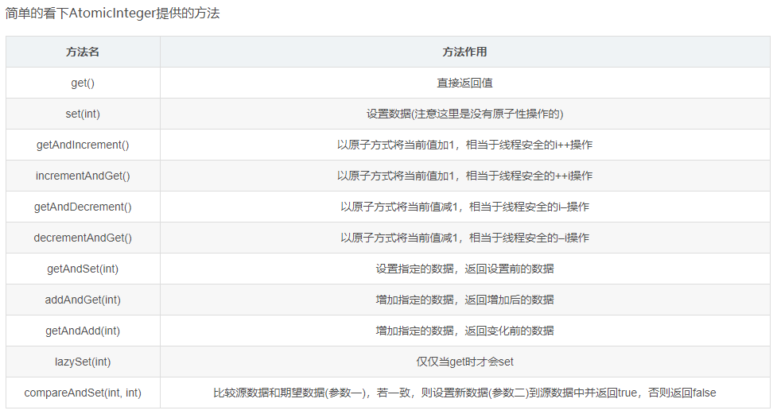

# 集合框架


## Collection
1. Collection接口
	```
	boolean add(E e); //添加成功返回true
	boolean addAll(Collection<? extends E> c);

	boolean remove(Object o);
	boolean removeAll(Collection<?> c);

	boolean isEmpty();
	int size();
	void clear();

	//from iterable
	Iterator<E> iterator();
	void forEach(Consumer<? super T> action);
	Spliterator<T> spliterator();  

	Object[] toArray();
	<T> T[] toArray(T[] a);

	boolean contains(Object o);
	boolean containsAll(Collection<?> c);
	boolean removeIf(Predicate<? super E> filter)
	boolean retainAll(Collection<?> c);

	boolean equals(Object o);
	int hashCode();

	Stream<E> stream()
	Stream<E> parallelStream()

	```
	AbtractCollection\<E>将基础方法size()和iterator()方法抽象化。

	Iterator\<E>
	```
	boolean hasNext();
	E next();
	void remove()
	```
### List
	1. List继承Collection接口，并添加了新的方法
	```
	void add(int index, E element) //插入
	boolean addAll(int index, Collection<? extends E> c)
	
	E get(int index)
	E set(int index, E element)
	
	int indexOf(Object o)
	int lastIndexOf(Object o)
	ListIterator<E> listIterator()
	ListIterator<E> listIterator(final int index)
	E remove(int index)
	
	List<E> subList(int fromIndex, int toIndex)
	```
	ListIterator\<E>接口
	```
	void add(E e);
	void set(E e);
	
	boolean hasNext();
	E next();
	void remove();
	```


	boolean hasPrevious();
	E previous();
	int previousIndex();
	
	int nextIndex();
	```
2. ArrayList LinkedList Vector CopyOnWriteArrayList 对比 区别
	1.  ArrayList是最常用的List实现类，内部是通过数组实现的，它允许对元素进行**快速随机访问**。数组的缺点是每个元素之间不能有间隔，当数组大小不满足时需要增加存储能力，就要将已经有数组的数据复制到新的存储空间中。当从ArrayList的中间位置插入或者删除元素时，需要对数组进行复制、移动、代价比较高。（**所以两个缺陷，需要扩容，插入或删除元素代价高**）因此，它适合随机查找和遍历，不适合插入和删除。
	2. ArrayList 允许添加空值NULL，以原数组容量1.5倍数扩容，ArrayList内部使用<T> T[] Arrays.copyOf(T[] original, int newLength) 方法实现数组扩容，System.copyarray()实现插入、删除元素，ArrayList不会自动缩容，可以调用trimToSize()实现缩容
	
	3.  Vector与ArrayList一样，也是通过数组实现的，不同的是它**支持线程的同步**，即某一时刻只有一个线程能够写Vector，避免多线程同时写而引起的不一致性，但实现同步需要很高的花费，因此，访问它比访问ArrayList慢。Vector 同样基于AbstractList实现，Stack类基于Vector实现。
	4.  LinkedList是用链表结构存储数据的，很适合数据的动态插入和删除，随机访问和遍历速度比较慢。另外，他还实现了Deque接口，提供了List接口中没有定义的方法，专门用于操作表头和表尾元素，可以当作栈、队列和**双向队列**使用。LinkedList 遍历只适合用迭代器，不适合使用 fori语句，性能很差。
	5. ArrayList 实现了RandomAccess接口
	6. CopyOnWriteArrayList的add、set、remove等会改变原数组的方法中，都是先copy一份原来的array，再在copy数组上进行add、set、remove操作，这就才不影响COWIterator那份数组
### Queue
Queue接口
直接实现Queue接口的类好像只用`PriorityQueue`，Deque接口继承Queue，实现Deque接口的类也间接实现了Queue接口，包括`ArrayDeque` `LinkedList`
1. 如何设置队列或者栈的大小
[ add/offer，element/peek，remove/poll区别](https://blog.csdn.net/u012050154/article/details/60572567)
```
boolean add(E e); //若队列有长度限制，向已满队列添加元素会抛出异常
boolean offer(E e); //向已满队列添加元素会返回false

E remove(); //抛异常
E poll(); //返回特殊值

E element(); //抛异常/
E peek();    //返回特殊值
```
Deque接口
```
void addFirst(E e);
boolean offerFirst(E e);
E getFirst();
E peekFirst();
E pollFirst();
E removeFirst();

E pop();
void push(E e);
```

### Map 

1. Map\<k,v>接口
```
V put(K key, V value);
V void putAll(Map<? extends K, ? extends V> m);

V get(Object key);
V getOrDefault(Object key, V defaultValue);

V remove(Object key);
boolean remove(Object key, Object value)

boolean isEmpty();
int size();

boolean containsKey(Object key);
boolean containsValue(Object value);

void clear();

Collection<V> values();
Set<K> keySet();
Set<Map.Entry<K, V>> entrySet();


```

2. HashMap LinkedHashMap  ConconrrentHashMap
* HashMap线程不安全 ，最多可以存入一条 键为null的记录可以使用Collections.synchronizedMap()方法可以使其线程安全，但是效率比较低，应该任何时候只有一个线程可以进行写操作，不如ConcurrentHashMap 性能好。
* LinkedHashMap 通过额外的双向链表记录键值对的插入顺序，或者是键值对的访问顺序
* ConcurrentHashMap 通过细颗粒的加锁机制，可实现高效并发访问
3. HashTable
HashTable 线程安全(任何时候只能一个线程能进行写操作)，继承自抽象类Dictionary<K,V>，实现了Map接口，HashTable不能存放NULL键。

4. TreeMap


## 线程安全集合
|  interface|implementation |线程安全implementation|
|--|--|--|
| List |ArrayList LinkedList| Vector/Stack(被弃用)|
|Queue/Deque|ArrayDeque LinkedList PriorityQueue|待查|
|Map | HashMap( LinkedHashMap 用链表记录插入顺序 ) TreeMap WeakHashMap HashTable IdentifyHashMap|ConcurrentHashMap|


## 视图 包装器
1. 包装器（Arrays Collections类中的静态方法） --->产生视图
视图技术对一些普通对象进行包装，产生一个实现具体集合接口的对象，但是这个对象具有一些局限性，包括只读不可修改，与正常实现集合接口的类型对象有区别。
Map.keySet() 返回实现Set接口的对象，这个方法对原map进行操作，这种集合称为视图（views）
Arrays.asList() 返回包装普通Java数组的List包装器。
```
Card[] cardDeck=new Card[52];
...
List<Card> cardlist=Arrays.asList(cardDeck);
```
2. 同步视图
HashMap不支持线程的同步，可能会导致数据的不一致。如果需要同步，可以用 Collections的synchronizedMap( )方法使HashMap具有同步的能力，或者使用ConcurrentHashMap(实现更精细的同步机制，对桶进行控制，可实现部分方法并行运行)

## Stream


# 多线程

## 概述

### 并发难点
1. 编译器优化 产生重排序 防止指令重排
volatile禁止指令重排序只能保证volatile修饰的代码之后的代码不会在它之前执行。
3. 内存可见性 多核CPU的每个核心有自己的高速缓存，每个核心都会将自己需要的数据读到独占缓存中，数据修改后也是写入到缓存中，然后等待刷入到主存中。所以会导致有些核心读取的值是一个**过期**的值。所有的共享变量存在于主内存中，**每个线程有自己的本地内存**，线程读写共享数据也是通过本地内存交换的，所以可见性问题依然是存在的。这里说的本地内存并不是真的是一块给每个线程分配的内存，而是 JMM 的一个抽象，是对于寄存器、一级缓存、二级缓存等的抽象。
4.  原子性
### 线程安全
属于基本数据类型的变量在多线程环境下被读-写是否自然线程安全？不安全。
什么时候会出现线程冲突？
	1. 多个线程同时写，线程A、线程B几乎同时修改变量A的值，线程A在没有完成重新写入操作前被剥夺运行权力，线程B随后对变量A进行修改，线程A在恢复运行后会覆盖掉线程B的修改动作。
	2. 线程A对变量A进行修改，没有完全完成，此时线程B读取变量A则获取的是旧值。

## Thread 状态

1. new
2. runnable
3. waiting(timed_waiting)
4. blocked
5. terminated

## waiting 和 blocked

1.两种状态的线程不被调度，不占用cpu时间。waiting状态的线程可以被interrupt()方法打断（waiting->runnable）。blocked状态的线程不会被interrupt()方法打断。

**waiting** 线程 在等待信号

1. 线程调用Object.wait() 方法会进入waiting状态
2. 线程调用LockSupport.park()进入waiting状态，会因为unpark()、**interrupt()**而从park()方法返回。（比较奇怪的是，park方法因为中断而返回，但是不会抛interruptedException。因为该方法由native代码实现？ )。线程同步工具类一般使用该方法去阻塞线程（并用队列或者链表记录所有waiting线程），等待条件满足后在唤醒该线程（调用unpark方法）。需要注意是存在多种原因导致线程恢复（从park()方法返回），所以在调用park方法的地方，需要使用死循环,检查条件是否已满足，若不满足仍需要调用park使线程等待。线程同步类一般会提前通过链表或者队列方式维护将进入等待状态的线程。在某个时间点去unpark waiting线程。FutureTask 通过单项链表方式维护所有等待结果的线程，在结果出来后 从链表中取出线程一一进行unpark。

ReentranceLock、BlockingQueue 都主要使用park方法阻塞线程。park方法阻塞线程的方式，Linux系统下使用的pthread_mutex_lock(unlock)

**blocked** 线程 在等待获取锁

1. synchronized关键字(对象锁)，线程同步过程存在出现 blocked状态

   wait方法（此时已经在同步代码块中）使线程进入waiting 状态，当notify方法被调用时，某一个waiting线程进入blocked状态，等待持锁线程释放锁。似乎只有这种场景线程会出现blocked状态。


参考文章

[Difference Between BLOCKED Vs WAITING States In Java]: https://javaconceptoftheday.com/difference-between-blocked-vs-waiting-states-in-java/


## 锁 条件变量

参考文章 https://www.cnblogs.com/waterystone/p/4920797.html

## ReentrantLock Condition

ReentrantLock 提供公平锁和非公平锁。功能委托给内部类FairSync NonfairSync（都继承自内部类Sync）。

Sync 继承Aqs。实现了nonfairTryAcquire()和TryRelease()

### ReentrantLock .lock方法

1. NonfairSync 首先尝试cas更新state 0->1,如果成功，说明锁空闲并且占用成功（setOwnerthread为自己）。如果失败则执行acquire(); acquire 方法先调用NonfairSync  tryAcquire 如果失败了则入队等待

   NonfairSync  tryAcquire：调用sync.nonfairTryAcquire()，如果 state=0,则插队拿锁

2. FairSync直接调用FairSync.tryAcquire。tryAcquire：如果state=0且等待队列为空，则占有锁。否则返回FALSE。

|             | NonfairSync                                                  | FairSync                                                     |
| ----------- | ------------------------------------------------------------ | ------------------------------------------------------------ |
| lock()      | cas state 0->1,若成功setOwnerthread为自己，并返回。否则AQS.acquire(1) | AQS.acquire(1)                                               |
| AQS.acquire | if (!tryAcquire(arg) && acquireQueued(addWaiter(Node.EXCLUSIVE), arg))     selfInterrupt(); | 若tryAcquire成功，则占锁成功直接返回，否则入队尾park,等待唤醒 |
| tryAcquire  | 调用Sync.nonfairTryAcquire():<br />若state=0,尝试cas 0->1,操作成功则返回true;<br />若state!=1,判断ownerThread是否为自己，若是state+,返回true;<br />返回false | 若state=0,**同时无前置节点**并且cas 0->1操作成功则返回true;<br />若state!=1,判断ownerThread是否为自己，若是state+,返回true;<br />返回false |

addWaiter: cas入队尾

```java
    /**
     * Creates and enqueues node for current thread and given mode.
     *
     * @param mode Node.EXCLUSIVE for exclusive, Node.SHARED for shared
     * @return the new node
     */
    private Node addWaiter(Node mode) {
        Node node = new Node(Thread.currentThread(), mode);
        // Try the fast path of enq; backup to full enq on failure
        Node pred = tail;
        if (pred != null) {
            node.prev = pred;
            if (compareAndSetTail(pred, node)) {
                pred.next = node;
                return node;
            }
        }
        enq(node);
        return node;
    }

    /**
     * Inserts node into queue, initializing if necessary. See picture above.
     * @param node the node to insert
     * @return node's predecessor
     */
    private Node enq(final Node node) {
        for (;;) {
            Node t = tail;
            if (t == null) { // Must initialize
                if (compareAndSetHead(new Node()))
                    tail = head;
            } else {
                node.prev = t;
                if (compareAndSetTail(t, node)) {
                    t.next = node;
                    return t;
                }
            }
        }
    }
```

acquireQueued(Node,acquiredValue) ：阻塞线程等待条件满足


```java
/**
 * Acquires in exclusive uninterruptible mode for thread already in
 * queue. Used by condition wait methods as well as acquire.
 *
 * @param node the node
 * @param arg the acquire argument
 * @return {@code true} if interrupted while waiting
 */
final boolean acquireQueued(final Node node, int arg) {
    boolean failed = true;
    try {
        boolean interrupted = false;
        for (;;) {
            final Node p = node.predecessor();
            if (p == head && tryAcquire(arg)) {
                setHead(node);
                p.next = null; // help GC
                failed = false;
                return interrupted;
            }
            if (shouldParkAfterFailedAcquire(p, node) &&
                parkAndCheckInterrupt())
                interrupted = true;
        }
    } finally {
        if (failed)
            cancelAcquire(node);
    }
}
```

1. 读写锁
2. 锁优化

### tryLock方法

调用sync.nonfairTryAcquire()：意味着会插队拿锁

## Synchronized


偏向锁：

自旋锁：不立刻放弃运行，做几个空循环后再去尝试获取锁

锁消除 逃逸分析

## Thread 类
### 方法
1. 静态方法

```java
boolean interrupted() //测试当前线程的中断标志位是否被置位，若被置位，清除并返回true
Thread currentThread() //获取当前线程对应的Thread对象
void yield() //阻塞当前线程，放弃时间片
void sleep()
```
2. 实例方法

```java
void interrupt() //中断该线程
boolean isInterrupted() //判断线程标志位是否被置位
void join() //等待目标线程终止
```

### 未捕获异常处理器

实现Thread.UncaughtExceptionHandler 接口的类可作为线程的异常处理器，处理线程抛出的非受查异常。

```java
public interface UncaughtExceptionHandler{
    void uncaughtException(Thread t, throwable e);
}
```

```java
void setUncaughtExceptionHandler(); //为线程指定异常处理器
static void setDefaultUncaughtExceptionHandler(); //静态方法，为所有线程设置默认异常处理器
```

如果一个线程无单独处理器，也无默认处理器（为空），则处理器为 线程的ThreadGroup对象（该类实现了所提接口），该对象的uncaughtException()方法默认行为：

1. 如果有父线程组，调用父线程组uncaughtException()方法
2. 否则，检查是否有默认处理器，有调用
3. 否则，异常属于ThreadDeath 实例 什么都不干
4. 否则，将线程名和栈轨迹 输出到system.err


### 线程组

1. 打印所有活动线程

```java
    public static void getAllThreads(){
        //获取所在线程的Thread对象
        Thread currentThread=Thread.currentThread();
        System.out.println("Thread name : " + currentThread.getName());
        //获取所在的线程组
        ThreadGroup group=currentThread.getThreadGroup();
        ThreadGroup rootGroup=group;
        //获取根线程组
        while(group.getParent()!=null){
            rootGroup=group.getParent();
            group=rootGroup;
        }
        //多准备一倍空间，防止后续线程又增加
        int slackSize= rootGroup.activeCount()*2;
        Thread[] slackThreads=new Thread[slackSize];
        //方法返回实际线程数量
        int actualSize=rootGroup.enumerate(slackThreads);
        Thread[] actualThreads=new Thread[actualSize];
        System.arraycopy(slackThreads,0,actualThreads,0,actualSize);
        System.out.println("Threads size is " + actualThreads.length);
        for (Thread thread:actualThreads){
            System.out.println("Thread name : " + thread.getName());
        }
    }
```

2. jvm 运行会起五个线程



### Future Callable

1. Callable Future
```java
interface Callable<V>{
	V call() throws Exception;
}

interface Future<V> {}
```


## FutureTask<V>

源码解析https://www.jianshu.com/p/55221d045f39

> 内部使用了Unsafe提供的CAS和LockSupport 协调 任务线程和查询线程之间同步问题。
>
> 1. 保证只有一个线程运行该任务，避免多个线程也接该任务
> 2. 可能有多个其他线程查询结果，使用了LockSupport阻塞这些查询线程，并用链表维护所有等待的线程，当任务完成后，逐一释放许可

该类同时实现了Runnable 和Future接口


## 阻塞队列

| 队列                                                         | 说明         |
| ------------------------------------------------------------ | ------------ |
| LinkedBlockingQueue(基于循环数组)                            | 无界阻塞队列 |
| ArrayBlockingQueue(基于双向链表)                             | 有界队列     |
| PriorityBlockingQueue(基于二叉堆)                            |              |
| LinkedBlockingDeque是双向阻塞队列，实现的是BlockingDeque接口 |              |
| SynchronousQueue                                             |              |

阻塞队列 BlockingQueue接口


```java
puts操作
add(E e) : 添加成功返回true，失败抛IllegalStateException异常
offer(E e) : 成功返回 true，如果此队列已满，则返回 false（如果添加了时间参数，且队列已满也会阻塞）
put(E e) :将元素插入此队列的尾部，如果该队列已满，则一直阻塞

takes操作
remove(Object o) :移除指定元素,成功返回true，失败返回false
poll() : 获取并移除此队列的头元素，若队列为空，则返回 null（如果添加了时间参数，且队列中没有数据也会阻塞）
take()：获取并移除此队列头元素，若没有元素则一直阻塞。
peek() :获取但不移除此队列的头；若队列为空，则返回 null。

other操作
contains(Object o)：队列中是否包含指定元素
drainTo(Collection<? super E> c)：队列转化为集合
```


## 线程池 ExecutorService 接口

1. 常用API

```java
Future<?> submit(Runnable task);
Future<T> submit(Runnable task, T result);
Future<T> submit(Callable<T> task);
void shutdown(); //将线程池状态变为 shutdown,拒绝接受新任务，异步，直接返回不等待线程任务全部完成
boolean awaitTermination(); //阻塞当前线程，直到所有任务完成
List<Runnable> shutdownNow(); //尝试停止所有活动任务，并返回等待执行的任务列表
```

2. 使用Executors类静态方法创建线程池

   1. newFixedThreadPool()：创建一个指定工作线程数量的线程池。每当提交一个任务就创建一个工作线程，如果工作线程数量达到线程池初始的最大数，则将提交的任务存入到池队列中。

   2. newSingleThreadExecutor()：创建一个单线程化的Executor，即只创建唯一的工作者线程来执行任务，它只会用唯一的工作线程来执行任务，保证所有任务按照指定顺序(FIFO, LIFO, 优先级)执行。如果这个线程异常结束，会有另一个取代它，保证顺序执行。

   3. newCachedThreadPool()：创建一个可缓存线程池，如果线程池长度超过处理需要，可灵活回收空闲线程，若无可回收，则新建线程

   4. newScheduledThreadPool(): 创建一个定长的线程池，而且支持定时的以及周期性的任务执行，支持定时及周期性任务执行。
### ThreadPoolExecutor类

> https://www.cnblogs.com/CarpenterLee/p/9558026.html

```java
// Java线程池的完整构造函数
public ThreadPoolExecutor(
  int corePoolSize, // 线程池长期维持的线程数，即使线程处于Idle状态，也不会回收。
  int maximumPoolSize, // 线程数的上限
  long keepAliveTime, TimeUnit unit, // 超过corePoolSize的线程的idle时长，
                                     // 超过这个时间，多余的线程会被回收。
  BlockingQueue<Runnable> workQueue, // 任务的排队队列
  ThreadFactory threadFactory, // 新线程的产生方式
  RejectedExecutionHandler handler) // 拒绝策略
```

- `corePoolSize`和`maximumPoolSize`设置不当会影响效率，甚至耗尽线程；
- `workQueue`设置不当容易导致OOM；
- `handler`设置不当会导致提交任务时抛出异常

1. 线程池的工作顺序


> If fewer than corePoolSize threads are running, the Executor always prefers adding a new thread rather than queuing.
> If corePoolSize or more threads are running, the Executor always prefers queuing a request rather than adding a new thread.
> If a request cannot be queued, a new thread is created unless this would exceed maximumPoolSize, in which case, the task will be rejected.

corePoolSize -> 任务队列 -> maximumPoolSize -> 拒绝策略

### 如何正确使用线程池



1. 避免使用无界队列

不要使用`Executors.newXXXThreadPool()`快捷方法创建线程池，因为这种方式会使用无界的任务队列，为避免OOM，我们应该使用`ThreadPoolExecutor`的构造方法手动指定队列的最大长度：

```java
ExecutorService executorService = new ThreadPoolExecutor(2, 2, 
                0, TimeUnit.SECONDS, 
                new ArrayBlockingQueue<>(512), // 使用有界队列，避免OOM
                new ThreadPoolExecutor.DiscardPolicy());
```

2. 明确拒绝任务时的行为

任务队列总有占满的时候，这是再`submit()`提交新的任务会怎么样呢？`RejectedExecutionHandler`接口为我们提供了控制方式，接口定义如下：

```java
public interface RejectedExecutionHandler {
    void rejectedExecution(Runnable r, ThreadPoolExecutor executor);
}
```


## ThreadLocal

通过ThreadLocal实例每个线程都有一个“线程隔离”变量副本, 这个副本作用范围比局部变量大，属于线程级别的全局变量**存在 OOM可能？需要释放资源？**


## 线程同步工具类
### 1. semaphore 信号量
生成实例时可以指定permits个数，acquire()方法消耗一个许可，release()方法增加一个许可
### 2. CountDownLatch 倒计时器

```java
void countDown()
void await()
```

### 3. CyclicBarrier 循环屏障
   允许一组线程互相等待，直到到达某个公共屏障点 (common barrier point)。在涉及一组固定大小的线程的程序中，这些线程必须不时地互相等待，此时 CyclicBarrier 很有用。因为该 barrier 在释放等待线程后可以重用，所以称它为_循环_ 的 barrier。

```java
int await() //使参与者等待
void reset() //将屏障重置为其初始状态
```

### 4. LockSupport

https://www.jianshu.com/p/f1f2cd289205

线程可以使用LockSupport.park() 阻塞自己，当有其他线程调用unpark(targetThread)时，线程继续运行。如果线程在阻塞状态下其中断标志位被置位，线程会立刻恢复运行，不抛出异常，需要使用Thread.interrupted()检测自己是如何被放行的（得到许可还是被中断）

一个线程还未运行到 park() 处，有另外一个线程提前使用unpark()释放许可，则该线程运行到park()时可以直接继续运行。


```java
void park();
void park(Thread thread);
```


## 原子类

参考博客：https://blog.csdn.net/qq_30379689/article/details/80785650

>Atomic的包名为java.util.concurrent.atomic。这个包里面提供了一组原子变量的操作类，这些类可以保证在多线程环境下，当某个线程在执行atomic的方法时，不会被其他线程打断，而别的线程就像自旋锁一样，一直等到该方法执行完成，才由JVM从等待队列中选择一个线程执行

### CAS

CAS指的是现代CPU广泛支持的一种对内存中的共享数据进行操作的一种特殊指令。这个指令会对内存中的共享数据做原子的读写操作。在Java并发应用中通常指CompareAndSwap或CompareAndSet，即比较并交换，是实现并发算法时常用到的一种技术。java.util.concurrent包中借助CAS实现了区别于synchronized同步锁的一种乐观锁。乐观锁就是每次去取数据的时候都乐观的认为数据不会被修改，因此这个过程不会上锁，但是在更新的时候会判断一下在此期间的数据有没有更新

1. CAS思想

CAS有三个参数，当前内存值V、旧的预期值A、即将更新的值B，当且仅当预期值A和内存值V相同时，将内存值修改为B并返回true，否则什么都不做，并返回false

2. CAS优缺点

系统在硬件层面保证了CAS操作的原子性，不会锁住当前线程，它的效率是很高的。但是在并发越高的条件下，失败的次数会越多，CAS如果长时间不成功，会极大的增加CPU的开销，因此CAS不适合竞争十分频繁的场景
CAS只能保证一个共享变量的原子操作，对多个共享变量操作时，无法保证操作的原子性，这时就可以用锁，或者把多个共享变量合并成一个共享变量来操作。JDK提供了AtomicReference类来保证引用对象的原子性，可以把多个变量放在一个对象里来进行CAS操作

3. ABA

CAS在操作值的时候检查值是否已经变化，没有变化的情况下才会进行更新。但是如果一个值原来是A，变成B，又变成A，那么CAS进行检查时会认为这个值没有变化，但是实际上却变化了。ABA问题的解决方法是使用版本号。在变量前面追加上版本号，每次变量更新的时候把版本号加一，那么A－B－A就变成1A－2B－3A。JDK提供了AtomicStampedReference来解决ABA问题

### Atomic 类

Atomic成员分为四大块

1. 原子方式更新基本类型
2. 原子方式更新数组
3. 原子方式更新引用
4. 原子方式更新字段

**一、原子方式更新基本类型**

- AtomicBoolean：原子更新布尔类型
- AtomicInteger：原子更新整型
- AtomicLong：原子更新长整型



### Unsafe 类

https://tech.meituan.com/2019/02/14/talk-about-java-magic-class-unsafe.html

java语言中的指针

## CompletableFuture 接口