## JVM启动参数

### client/server模式

-client
 设置jvm使用client模式，特点是启动速度比较快，但运行时性能和内存管理效率不高，通常用于客户端应用程序或者PC应用开发和调试。

-server
 设置jvm使server模式，特点是启动速度比较慢，但运行时性能和内存管理效率很高，适用于生产环境。在具有64位能力的jdk环境下将默认启用该模式，而忽略-client参数。

修改方式:
64位系统默认在 JAVA_HOME/jre/lib/amd64/jvm.cfg
32位在目录JAVA_HOME/jre/lib/i386/jvm.cfg

### JMM有关参数

| 参数 | 作用       |
| ---- | ---------- |
| -Xmx | 堆的最大值 |
| -Xms | 堆的初始值 |
|      |            |
|      |            |

> java -Xms3550m -Xmx3550m  -Xmn2g   -Xss128k

-Xms3550m:设置JVM堆初始化内存大小为3550m.默认为物理内存的1/64，最小为1M；可以指定单位，比如k、m，若不指定，则默认为字节此值可以设置与-Xmx相同,以避免每次垃圾回收完成后JVM重新分配内存.
-Xmx3550m:设置JVM堆最大可用内存为3550M.默认为物理内存的1/4或者1G，最小为2M；单位与-Xms一致。
-Xmn2g:设置年轻代大小为2G.

The flag `Xmx` specifies the maximum memory allocation pool for a Java virtual machine (JVM), while `Xms` specifies the initial memory allocation pool.

This means that your JVM will be started with `Xms` amount of memory and will be able to use a maximum of `Xmx` amount of memory. For example, starting a JVM like below will start it with 256 MB of memory and will allow the process to use up to 2048 MB of memory:

```java
java -Xms256m -Xmx2048m
```

The memory flag can also be specified in different sizes, such as kilobytes, megabytes, and so on.

```java
-Xmx1024k
-Xmx512m
-Xmx8g
```

The `Xms` flag has no default value, and `Xmx` typically has a default value of 256 MB. A common use for these flags is when you encounter a `java.lang.OutOfMemoryError`.

When using these settings, keep in mind that these settings are for the JVM's *heap*, and that the JVM can/will use more memory than just the size allocated to the heap.

## JVM 组件

1. 类加载器
2. 垃圾收集器
3. 执行引擎 （解释器  JIT 即时编译器？）

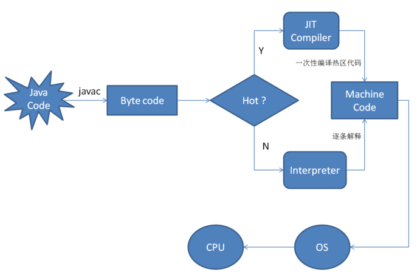

当虚拟机发现某个方法或代码块的运行特别频繁时，就会把这些代码认定为“热点代码”。

为了提高热点代码的执行效率，在运行时，虚拟机将会把这些代码编译成与本地平台相关的机器码，并进行各种层次的优化，完成这个任务的编译器称为即时编译器（Just In Time Compiler），简称 JIT 编译器

在 HotSpot 中，解释器和 JIT 即时编译器是同时存在的，他们是 JVM 的两个组件。对于不同类型的应用程序，用户可以根据自身的特点和需求，灵活选择是基于解释器运行还是基于 JIT 编译器运行。HotSpot 为用户提供了几种运行模式供选择，可通过参数设定，分别为：解释模式、编译模式、混合模式，HotSpot 默认是混合模式，需要注意的是编译模式并不是完全通过 JIT 进行编译，只是优先采用编译方式执行程序，但是解释器仍然要在编译无法进行的情况下介入执行过程。

## jvm 内存

Difference between Resident Set Size (RSS) and Java total committed memory (NMT) for a JVM running in Docker container

https://stackoverflow.com/questions/38597965/difference-between-resident-set-size-rss-and-java-total-committed-memory-nmt

### heap layout

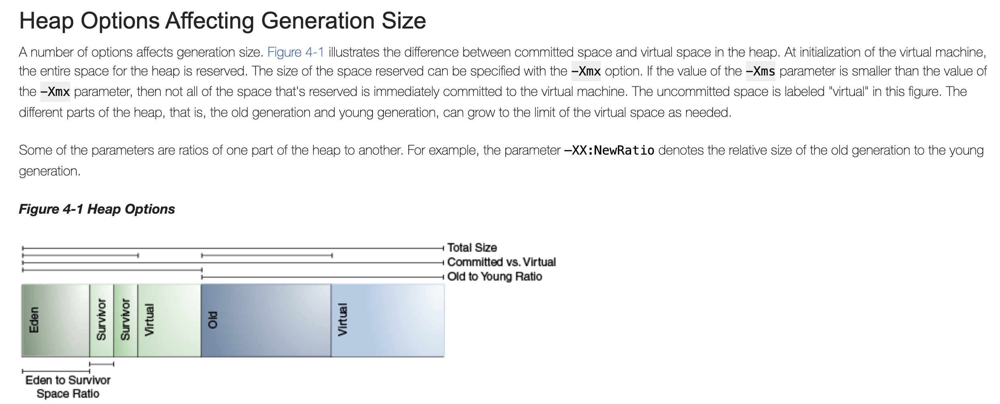

图自

https://docs.oracle.com/javase/9/gctuning/factors-affecting-garbage-collection-performance.htm#JSGCT-GUID-6635C481-AE78-485A-A184-A1709712961A

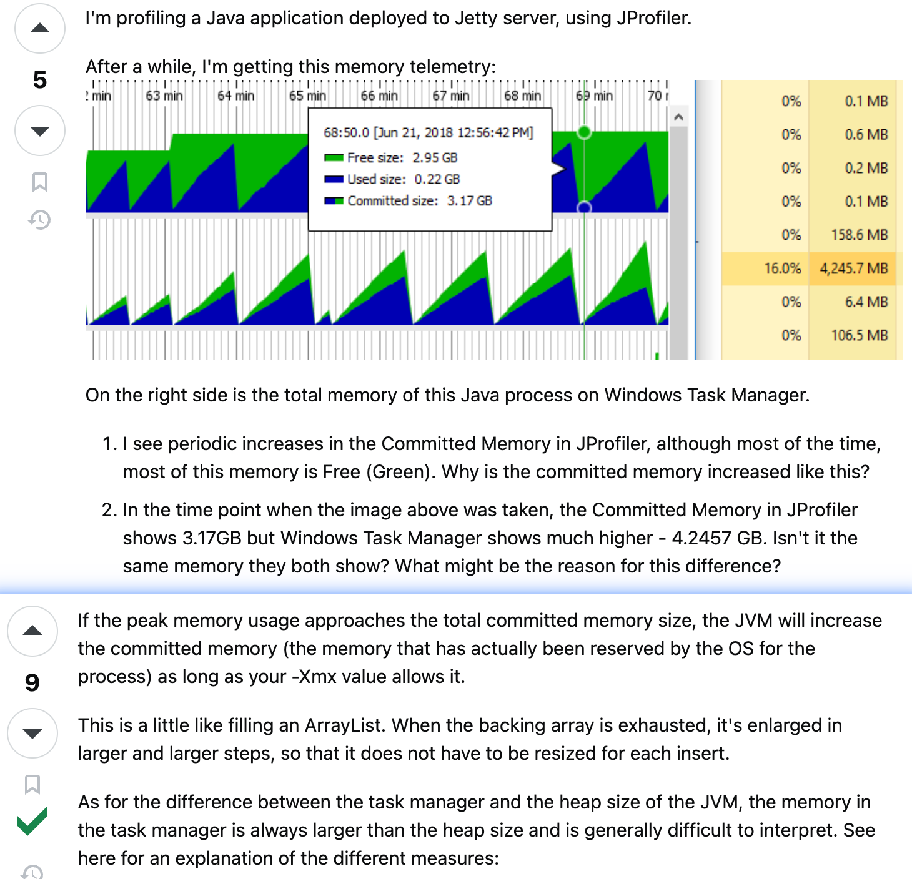

图自

https://stackoverflow.com/questions/50965967/profiling-jvm-committed-vs-used-vs-free-memory

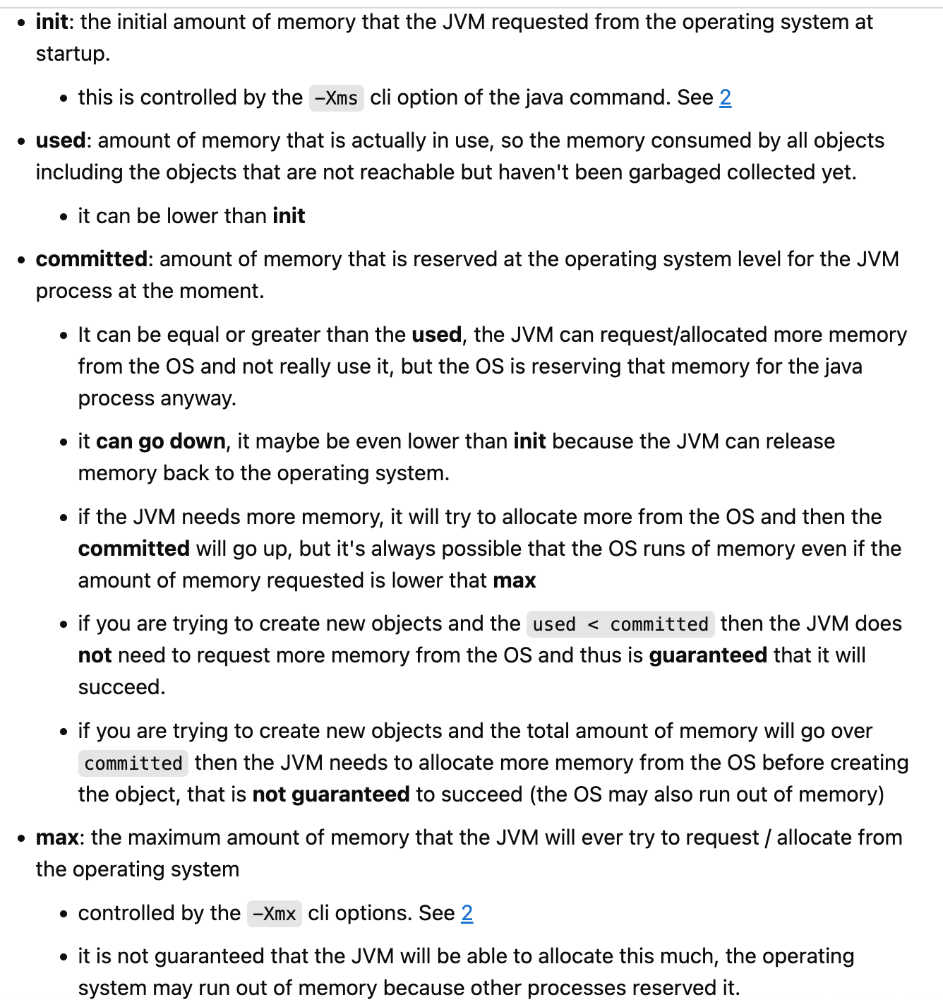

图自

https://stackoverflow.com/questions/41468670/difference-in-used-committed-and-max-heap-memory

### jvm内存类型

https://plumbr.io/blog/memory-leaks/why-does-my-java-process-consume-more-memory-than-xmx

```
不准确
Max memory = [-Xmx] + [-XX:MaxPermSize] + number_of_threads * [-Xss]
```

heap memory+ non heap memory

non heap memory:

* java thread stack + native method stack
* Metaspace (MaxPermSize)
  If you are an early adopter of Java 8, you are using metaspace instead of the good old permgen to store class declarations. This is unlimited and in a native part of the JVM.
* jit (code cache)

The Just-In-Time (JIT) compiler stores its output in the code cache area. A JIT compiler compiles bytecode to native code for frequently executed sections, aka Hotspots. The tiered compilation, introduced in Java 7, is the means by which the client compiler (C1) compiles code with instrumentation, and then, the server compiler (C2) uses the profiled data to compile that code in an optimized manner. The goal of the tiered compilation is to mix C1 and C2 compilers to have both fast startup times and good long-term performance. Tiered compilation increases the amount of code that needs to be cached in memory by up to four times. Since Java 8, this is enabled by default for JIT, although we still can disable tiered compilation.

JIT optimization. Java Virtual Machine optimizes the code during runtime. Again, to know which parts to optimize it needs to keep track of the execution of certain code parts. So again, you are going to lose memory.

* direct memory

If you happen to use off-heap memory, for example while using direct or mapped [ByteBuffers](http://docs.oracle.com/javase/7/docs/api/index.html?java/nio/ByteBuffer.html) yourself or via some clever 3rd party API then voila – you are extending your heap to something you actually cannot control via JVM configuration.

* gc 所使用的内存

As you might recall, Java is a garbage-collected language. In order for the garbage collector to know which objects are eligible for collection, it needs to keep track of the object graphs. So this is one part of the memory lost to this internal bookkeeping. [G1](https://plumbr.io/handbook/garbage-collection-algorithms-implementations#g1) is especially known for its excessive appetite for additional memory, so be aware of this.

* symbol

stores symbols such as field names, method signatures, and interned strings.
The JVM uses the Symbol area to store symbols such as field names, method signatures, and interned strings. In the Java development kit (JDK), symbols are stored in three different tables:

The System Dictionary contains all the loaded type information like Java classes.
The Constant Pool uses the Symbol Table data structure to save loaded symbols for classes, methods, fields, and enumerable types. The JVM maintains a per-type constant pool called the Run-Time Constant Pool, which contains several kinds of constants, ranging from compile-time numeric literals to runtime methods and even field references.
The String Table contains the reference to all the constant strings, also referred to as interned strings.

* JNI

#### Native Memory Track (NMT工具)

https://www.baeldung.com/java-memory-beyond-heap

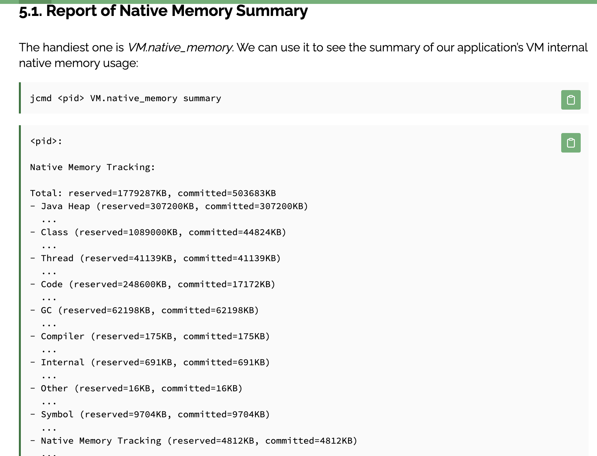

“reserved” memory means the total address range pre-mapped via *malloc* or  *mmap* , so it is the maximum addressable memory for this area.

“committed” means the memory actively in use.

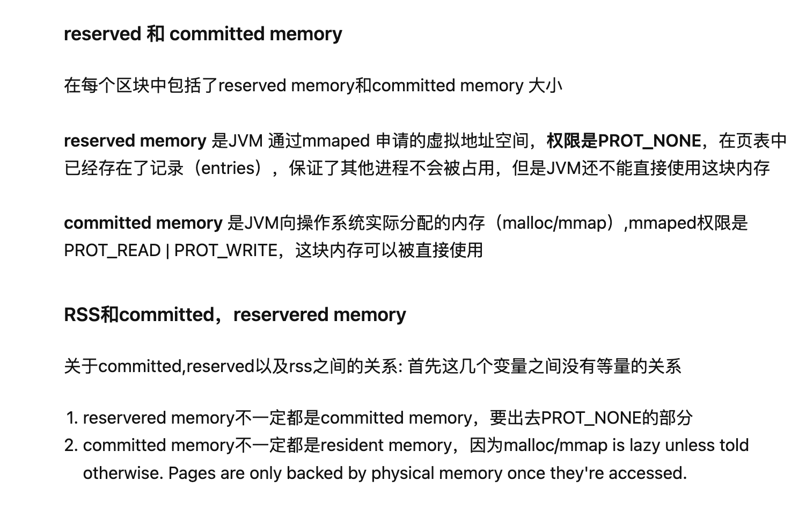

stackoverflow讨论 nmt只统计到了jvm 各内存区域 commited 大小，未统计到used大小，所以nmt 统计的commited 总大小 和其他指令统计的RSS 有区别

https://stackoverflow.com/questions/38597965/difference-between-resident-set-size-rss-and-java-total-committed-memory-nmt


### 栈内存 堆内存

在函数中定义的一些基本类型的变量和对象的引用变量都是在函数的栈内存中分配。当在一段代码块中定义一个变量时，java就在栈中为这个变量分配内存空间，当超过变量的作用域后，java会自动释放掉为该变量分配的内存空间，该内存空间可以立刻被另作他用。

堆内存用于存放由new创建的对象和数组。在堆中分配的内存，由java虚拟机自动垃圾回收器来管理。在堆中产生了一个数组或者对象后，还可以在栈中定义一个特殊的变量，这个变量的取值等于数组或者对象在堆内存中的首地址，在栈中的这个特殊的变量就变成了数组或者对象的引用变量，以后就可以在程序中使用栈内存中的引用变量来访问堆中的数组或者对象，引用变量相当于为数组或者对象起的一个别名，或者代号。

引用变量是普通变量，定义时在栈中分配内存，引用变量在程序运行到作用域外释放。而数组＆对象本身在堆中分配，即使程序运行到使用new产生数组和对象的语句所在地代码块之外，数组和对象本身占用的堆内存也不会被释放，数组和对象在没有引用变量指向它的时候，才变成垃圾，不能再被使用，但是仍然占着内存，在随后的一个不确定的时间被垃圾回收器释放掉。这个也是java比较占内存的主要原因，实际上，栈中的变量指向堆内存中的变量，这就是 Java 中的指针!

### Java 运行内存模型

[reference tutorial](https://www.journaldev.com/2856/java-jvm-memory-model-memory-management-in-java#comments)


1. **方法区**(线程共享)

  存储已被虚拟机加载的类信息、常量、静态变量、即时编译器编译后的代码等数据。

  **运行时常量池**属于方法区一部分，保存常量。

运行时常量池：是方法区的一部分，Class文件除了有类的版本、字段、方法、接口等描述信息外，还有一项信息是常量池，用于存放编译器生成的各种符号引用，这部分内容将在类加载后放到方法区的运行时常量池中。

2. **Java堆** (线程共享)
   
3. Java虚拟机栈（线程独立）

  每个线程都是一个代码执行流，需要栈维护函数正常调用过程。每个线程必须有一个独立栈空间。

4. 本地方法栈

  

5. 程序计数器

  

## ClassLoader 类加载机制

1. ClassLoader是Java运行时系统组件，负责在运行时查找和载入类字节码文件。类被装入JVM经过以下步骤：**装载->解析->初始化**
   JVM在运行时生成三个ClassLoader对象，

| 装载器                         | 功能                     | 关系                               |
| ------------------------------ | :----------------------- | ---------------------------------- |
| Bootstrap ClassLoader 根装载器 | 装载JRE核心类库 rt.jar等 | C++语言实现，不是ClassLoader的子类 |
| ExtClassLoader 扩展类加载器    | 装载JRE扩展目录下JAR类包 | 父类是根装载器                     |
| AppClassLoader 应用类加载器    | 装载ClassPath下类包      | 父类是ExtClassLoader               |

1. 根装载器  装载JRE核心类库 rt.jar等
2. ExtClassLoader 扩展类加载器  装载JRE扩展目录下JAR类包
3. AppClassLoader 应用类加载器  装载ClassPath下类包
4. 自定义的类加载器必须调用getSystemClassLoader()将AppClassLoader作为父类加载器（即存在一种依赖关系）。
5. 全盘负责委托机制

   ClassLoader使用的是双亲委托模型来搜索类的，每个ClassLoader实例都有一个父类加载器的引用（不是继承的关系，是一个包含的关系），虚拟机内置的类加载器（Bootstrap ClassLoader）本身没有父类加载器，但可以用作其它ClassLoader实例的的父类加载器。当一个ClassLoader实例需要加载某个类时，它会试图亲自搜索某个类之前，先把这个任务委托给它的父类加载器，这个过程是由上至下依次检查的，首先由最顶层的类加载器Bootstrap ClassLoader试图加载，如果没加载到，则把任务转交给Extension ClassLoader试图加载，如果也没加载到，则转交给App ClassLoader 进行加载，如果它也没有加载得到的话，则返回给委托的发起者，由它到指定的文件系统或网络等URL中加载该类。如果它们都没有加载到这个类时，则抛出ClassNotFoundException异常。否则将这个找到的类生成一个类的定义，并将它加载到内存当中，最后返回这个类在内存中的Class实例对象。

   **机制的作用及价值**

   避免重复加载 + 避免核心类篡改

   采用双亲委派模式的是好处是Java类随着它的类加载器一起具备了一种带有优先级的层次关系，通过这种层级关可以避免类的重复加载，当父亲已经加载了该类时，就没有必要子ClassLoader再加载一次。其次是考虑到安全因素，java核心api中定义类型不会被随意替换，假设通过网络传递一个名为java.lang.Integer的类，通过双亲委托模式传递到启动类加载器，而启动类加载器在核心Java API发现这个名字的类，发现该类已被加载，并不会重新加载网络传递的过来的java.lang.Integer，而直接返回已加载过的Integer.class，这样便可以防止核心API库被随意篡改。
6. 重要方法
   Class loadClass(String name)
   Class defineClass(String name, byte[] b, int off, int len)
   Class findSystemClass(String name)
   Class findLoadedClass(String name)
   Class getParent()
7. 类的唯一性

类的唯一性与其classLoader有关，全限定类名+ClassLoader实例都相同才认为同一个类。会出现两个不同classLoader 加载同一个类文件的情况，jvm判定时会认为不是同一个

## CG机制

参考博客：**很全面** https://blog.csdn.net/justloveyou_/article/details/71216049

### 判读对象是否被回收

1. 引用计数算法：判断对象的引用数量

   　　引用计数算法是通过判断对象的引用数量来决定对象是否可以被回收。

   　　引用计数算法是垃圾收集器中的早期策略。在这种方法中，堆中的每个对象实例都有一个引用计数。当一个对象被创建时，且将该对象实例分配给一个引用变量，该对象实例的引用计数设置为 1。当任何其它变量被赋值为这个对象的引用时，对象实例的引用计数加 1（a = b，则b引用的对象实例的计数器加 1），但当一个对象实例的某个引用超过了生命周期或者被设置为一个新值时，对象实例的引用计数减 1。特别地，当一个对象实例被垃圾收集时，它引用的任何对象实例的引用计数器均减 1。任何引用计数为0的对象实例可以被当作垃圾收集。

   　　引用计数收集器可以很快的执行，并且交织在程序运行中，对程序需要不被长时间打断的实时环境比较有利，但其很难解决对象之间相互循环引用的问题。如下面的程序和示意图所示，对象objA和objB之间的引用计数永远不可能为 0，那么这两个对象就永远不能被回收。
   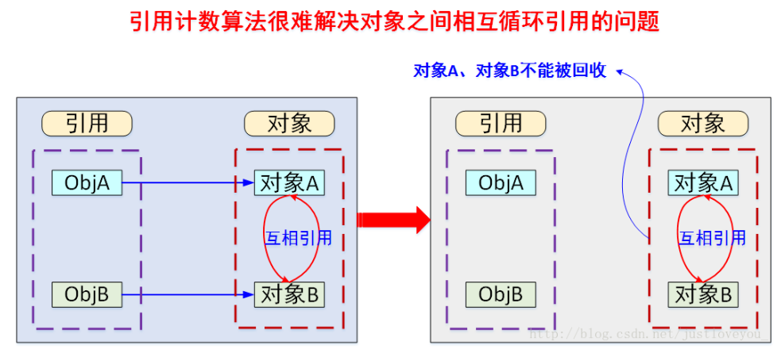

2、 可达性分析算法：判断对象的引用链是否可达

　　可达性分析算法是通过判断对象的引用链是否可达来决定对象是否可以被回收。

　　可达性分析算法是从离散数学中的图论引入的，程序把所有的引用关系看作一张图，通过一系列的名为 “GC Roots” 的对象作为起始点，从这些节点开始向下搜索，搜索所走过的路径称为引用链（Reference Chain）。当一个对象到 GC Roots 没有任何引用链相连（用图论的话来说就是从 GC Roots 到这个对象不可达）时，则证明此对象是不可用的，如下图所示。在Java中，可作为 GC Root 的对象包括以下几种：

虚拟机栈(栈帧中的局部变量表)中引用的对象；

方法区中类静态属性引用的对象；

方法区中常量引用的对象；

本地方法栈中Native方法引用的对象；

### 垃圾收集算法

**1、标记清除算法**

**2、复制算法**

**3、标记整理算法**

**4、分代收集算法**

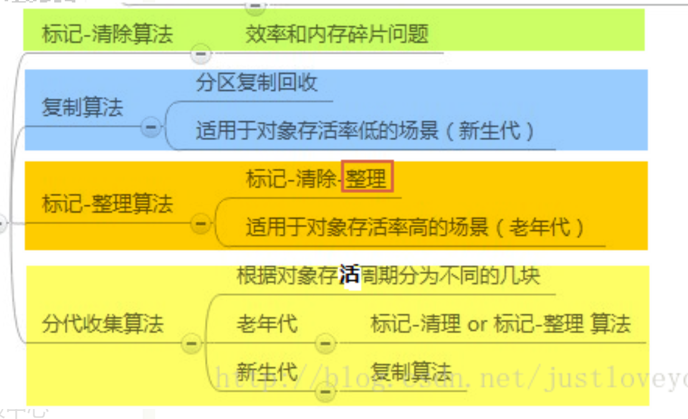

### 垃圾回收器

如果说垃圾收集算法是内存回收的方法论，那么垃圾收集器就是内存回收的具体实现。下图展示了7种作用于不同分代的收集器，其中用于回收新生代的收集器包括Serial、PraNew、Parallel Scavenge，回收老年代的收集器包括Serial Old、Parallel Old、CMS，还有用于回收整个Java堆的G1收集器。不同收集器之间的连线表示它们可以搭配使用。

1. Serial收集器**（复制算法): 新生代单线程收集器**，标记和清理都是单线程，优点是简单高效；
2. ParNew收集器 **(复制算法): 新生代收并行集器**，实际上是Serial收集器的多线程版本，在多核CPU环境下有着比Serial更好的表现；
3. Parallel Scavenge收集器 **(复制算法): 新生代并行收集器**，追求高吞吐量，高效利用CPU。吞吐量 = 用户线程时间/(用户线程时间+GC线程时间)，高吞吐量可以高效率的利用CPU时间，尽快完成程序的运算任务，适合后台应用等对交互相应要求不高的场景；
4. Serial Old收集器 **(标记-整理算法): 老年代单线程收集器**，Serial收集器的老年代版本；
5. Parallel Old收集器 **(标记-整理算法)： 老年代并行收集器**，吞吐量优先，Parallel Scavenge收集器的老年代版本；
6. **CMS**(Concurrent Mark Sweep)收集器（**标记-清除算法**）： **老年代并行收集器**，以获取最短回收停顿时间为目标的收集器，具有高并发、低停顿的特点，追求最短GC回收停顿时间。
7. G1(Garbage First)收集器 (标记-整理算法)： Java堆并行收集器，G1收集器是JDK1.7提供的一个新收集器，G1收集器基于“标记-整理”算法实现，也就是说不会产生内存碎片。此外，G1收集器不同于之前的收集器的一个重要特点是：G1回收的范围是整个Java堆(包括新生代，老年代)，而前六种收集器回收的范围仅限于新生代或老年代。

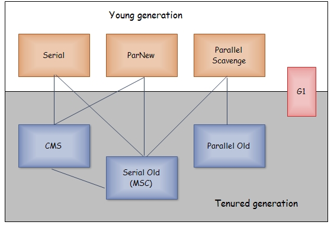

### CMS 收集器（Concurrent Mark Sweep ）标记-清除算法

> 以获取最短回收停顿时间为目标的收集器

分为4个步骤：

1. 初始标记：STW 标记GC Roots 能直接关联到的对象，很快
2. 并发标记： GC Roots Tracing，与工作线程同时进行
3. 重新标记:   修正并发标记期间因为用户程序继续运行而导致产生变动的那部分对象的标记记录，停顿时间比初始标记稍长，远比并发标记时间短。
4. 并发清除：与工作线程同时进行

整个过程耗时最长的并发标记和并发清除过程收集器线程都可以与用户线程一起工作。所以，从总体上来说，CMS收集器内存回收过程与用户线程一起并发执行。

### GC 日志

> -XX:+PrintGCDetails 输出GC的详细日志

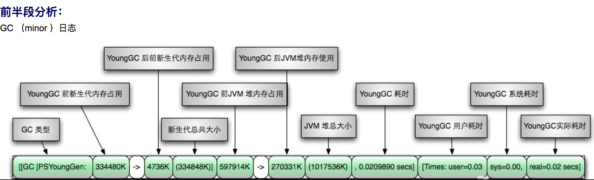

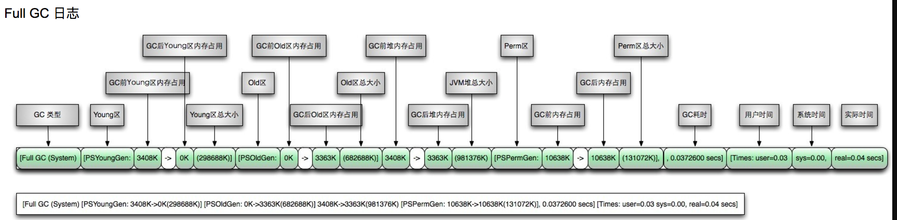

### 内存分配与回收策略

　　Java技术体系中所提倡的自动内存管理最终可以归结为自动化地解决了两个问题：给对象分配内存 以及 回收分配给对象的内存。一般而言，对象主要分配在新生代的Eden区上，如果启动了本地线程分配缓存(TLAB)，将按线程优先在TLAB上分配。少数情况下也可能直接分配在老年代中。总的来说，内存分配规则并不是一层不变的，其细节取决于当前使用的是哪一种垃圾收集器组合，还有虚拟机中与内存相关的参数的设置。

　　1) 对象优先在Eden分配，当Eden区没有足够空间进行分配时，虚拟机将发起一次MinorGC。现在的商业虚拟机一般都采用复制算法来回收新生代，将内存分为一块较大的Eden空间和两块较小的Survivor空间，每次使用Eden和其中一块Survivor。 当进行垃圾回收时，将Eden和Survivor中还存活的对象一次性地复制到另外一块Survivor空间上，最后处理掉Eden和刚才的Survivor空间。（HotSpot虚拟机默认Eden和Survivor的大小比例是8:1）当Survivor空间不够用时，需要依赖老年代进行分配担保。

　　2) 大对象直接进入老年代。所谓的大对象是指，需要大量连续内存空间的Java对象，最典型的大对象就是那种很长的字符串以及数组。

　　3) 长期存活的对象将进入老年代。当对象在新生代中经历过一定次数（默认为15）的Minor GC后，就会被晋升到老年代中。

　　4) 动态对象年龄判定。为了更好地适应不同程序的内存状况，虚拟机并不是永远地要求对象年龄必须达到了MaxTenuringThreshold才能晋升老年代，如果在Survivor空间中相同年龄所有对象大小的总和大于Survivor空间的一半，年龄大于或等于该年龄的对象就可以直接进入老年代，无须等到MaxTenuringThreshold中要求的年龄。

　　需要注意的是，Java的垃圾回收机制是Java虚拟机提供的能力，用于在空闲时间以不定时的方式动态回收无任何引用的对象占据的内存空间。也就是说，垃圾收集器回收的是无任何引用的对象占据的内存空间而不是对象本身。

### 空间分配担保

在发生Minor GC之前，虚拟机会检查**老年代最大可用的连续空间**是否大于**新生代所有对象的总空间**，

- 如果大于，则此次**Minor GC是安全的**
- 如果小于，则虚拟机会查看**HandlePromotionFailure**设置值是否允许担保失败。
  如果HandlePromotionFailure=true，那么会继续检查老年代最大可用连续空间是否大于**历次晋升到老年代的对象的平均大小**，如果大于，则尝试进行一次Minor GC，但这次Minor GC依然是有风险的；如果小于或者HandlePromotionFailure=false，则改为进行一次Full GC。

上面提到了Minor GC依然会有风险，是因为新生代采用**复制收集算法**，假如大量对象在Minor GC后仍然存活（最极端情况为内存回收后新生代中所有对象均存活），而Survivor空间是比较小的，这时就需要老年代进行分配担保，把Survivor无法容纳的对象放到老年代。**老年代要进行空间分配担保，前提是老年代得有足够空间来容纳这些对象**，但一共有多少对象在内存回收后存活下来是不可预知的，**因此只好取之前每次垃圾回收后晋升到老年代的对象大小的平均值作为参考**。使用这个平均值与老年代剩余空间进行比较，来决定是否进行Full GC来让老年代腾出更多空间。

取平均值仍然是一种**概率性的事件**，如果某次Minor GC后存活对象陡增，远高于平均值的话，必然导致担保失败，如果出现了分配担保失败，**就只能在失败后重新发起一次Full GC**。虽然存在发生这种情况的概率，但**大部分时候都是能够成功分配担保**的，这样就避免了过于频繁执行Full GC。

## JDK调试工具

1. jps: jvm process status tool 显示所有虚拟机进程
2. jstat: jvm statistics monitoring tool 监视虚拟机各种运行状态信息
3. jinfo: configuration info for java 显示虚拟机配置信息
4. jmap: memory map for java 生成虚拟机的内存转储快照（heapdump 文件）
5. jhat: jvm heap browser 分析heapdump文件，建立http服务器，让用户在浏览器查看分析结果
6. jstack: stack trace for java 显示虚拟机的线程快照
