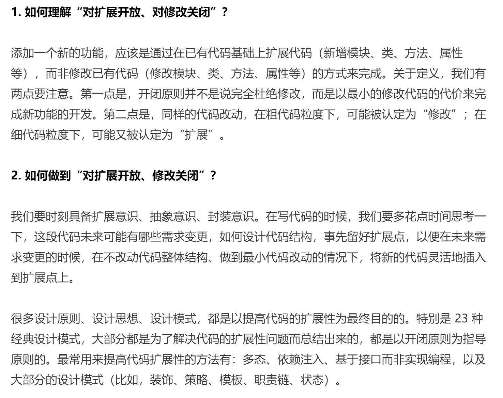
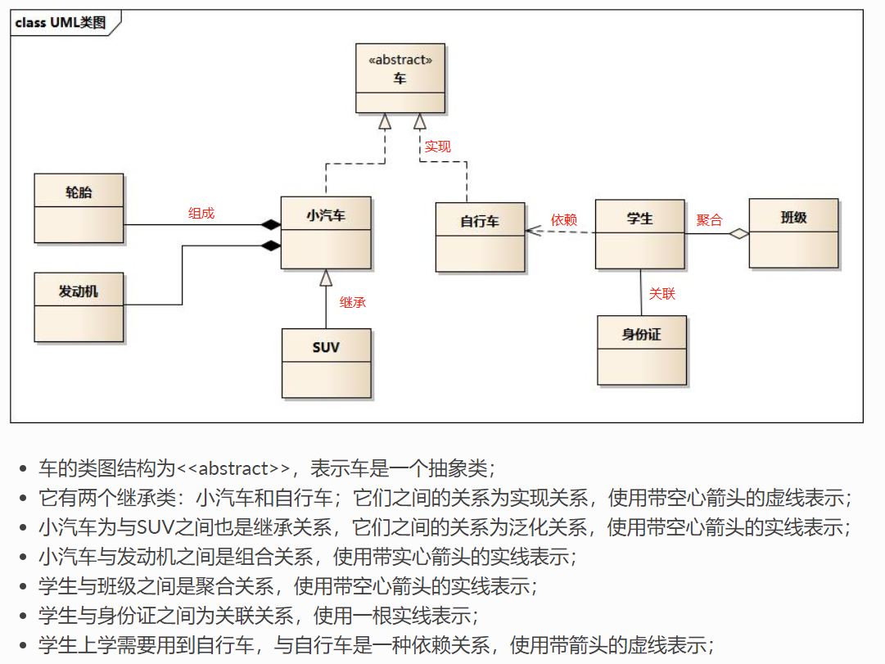
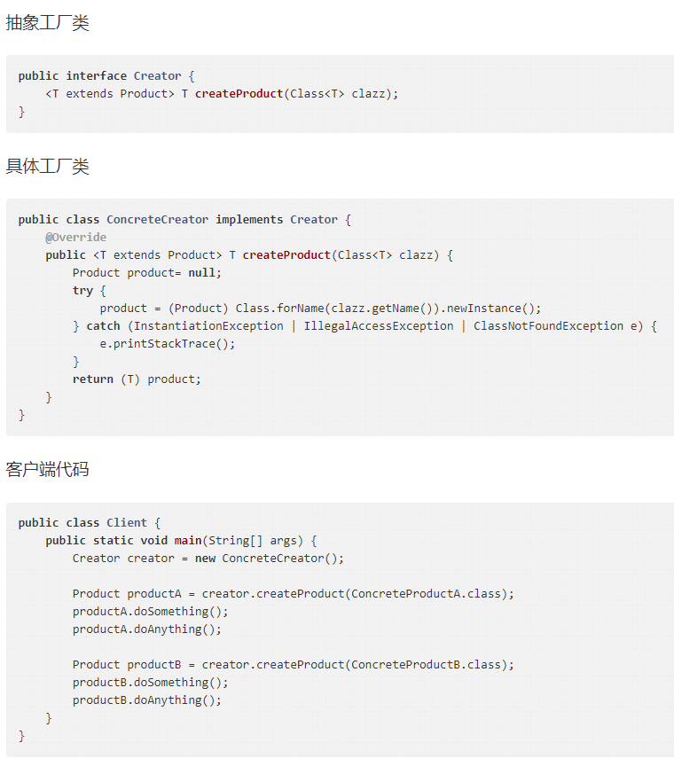

# 设计模式
## 设计思想
## 设计原则
**SOLID原则**
**S**ingle Responsibility Principle 单一职责原则SRP 

**O**pen Closed Principle 开闭原则 OCP

> 当添加新功能时 ，需对修改关闭（最小程度修改老代码，已有UT可确保原有功能的准确性），对扩展开放(新加类或者方法的方式实现功能)

**L**iskov Susbtitution Principle 里式替换原则 LSP

> 覆写父类的方法时，方法逻辑 应该严重遵守 父类对该方法签名 、行为的规定

**I**nterface Segregation Principle ISP 接口隔离原则 ISP

**D**ependency Inversion Principle 依赖反转原则 DIP


### 开闭原则 OCP



### 接口隔离原则 Interface Segregation Principle ISP 
这个原则光看名字，容易误解 它的中心思想（过多关注到 接口二字，会以为主要是强调接口的解耦作用。），实际重点 是后面的**隔离**二字。


1. 当接口 是一组API集合时：

强调 客户端 不应该依赖它不需要的接口（或者说不可见）。距离 UserService 提供对用户的查看、新建、删除等功能。大部分客户端只允许查看 新建用户，不允许删除用户。根据ISP原则应提供两个接口类，接口A只提供 查看、新建功能。接口B 提供删除功能。大部分客户端去使用接口A。


2. 当接口是一个接口或者函数时：

功能要单一，不将多个功能放在一个函数中实现。

类A 可以对传入数据做统计，计算最大值 、最小值、平均值等。在方法A中全部计算输出。如果客户端只需要一个 统计值 （比如最大值）。这个使用方法A 会造成一些无用计算。ISP倾向将方法A拆成多个细颗粒度的统计函数。


3. 当接口是OOP中接口时：

接口功能单一，不要让接口的实现者和调用者，依赖不需要的接口函数

case:

接口Config  提供读取配置的功能，

部分实现类需要能支持热功能。单独设计Update 接口。让这部分类实现它。调度类 获取所有Update实现类，定时调用他们，触发配置更新。

部分实现类需支持被监控。单独设计Viewer接口。然后。。。

 config 、update、 viewer 被一个类同时实现，但是对于类的使用方来看，只能看到它需要的那部分功能（使用方通过 具体接口来引用实现类）。update viewer接口可以在其他场景被服用。

不应该设计 一个大而全的Config 接口。不灵活，代码复用差


### 依赖反转原则DIP

1. 控制反转

流程的控制权 从程序员反转给了框架。

2. 依赖注入框架

框架自动创建、注入依赖、管理对象生命周期。该工作本来由程序员实现。


3. 为了追本溯源，我先给出这条原则最原汁原味的英文描述：

High-level modules shouldn’t depend on low-level modules. Both modules

should depend on abstractions. In addition, abstractions shouldn’t depend on

details. Details depend on abstractions.

我们将它翻译成中文，大概意思就是：高层模块（high-level modules）不要依赖低层模块（low-level）。高层模块和低层模块应该通过抽象（abstractions）来互相依赖。除此之外，抽象（abstractions）不要依赖具体实现细节（details），具体实现细节（details）依赖抽象（abstractions）。所谓高层模块和低层模块的划分，简单来说就是，在调用链上，调用者属于高层，被调用者属于低层。在平时的业务代码开发中，高层模块依赖底层模块是没有任何问题的。实际上，这条原则主要还是用来指导框架层面的设计，跟前面讲到的控制反转类似。我们拿 Tomcat这个 Servlet 容器作为例子来解释一下。

Tomcat 是运行 Java Web 应用程序的容器。我们编写的 Web 应用程序代码只需要部署在Tomcat 容器下，便可以被 Tomcat 容器调用执行。按照之前的划分原则，Tomcat 就是高层模块，我们编写的 Web 应用程序代码就是低层模块。Tomcat 和应用程序代码之间并没有直接的依赖关系，两者都依赖同一个“抽象”，也就是 Sevlet 规范。Servlet 规范不依赖具体的 Tomcat 容器和应用程序的实现细节，而 Tomcat 容器和应用程序依赖 Servlet规范。

## UML图


## 单例模式

1. 双重检验锁

```java
public class Singleton{
    private static volatile SingleInstance instance=null;
    private Singleton(){}
    public static Singleton getInstance(){
        if(instance==null){
            synchronized(Singleton.class){
                if(instance ==null){
                    instance=new Singleton();
                }
            }
        }
        return instance;
    }
}
```


2. 内部类方式

```java
public class Singleton{
    private Singleton(){}
    private static class Nested{
        public static final Singleton INSTANCE=new Singleton();
    }
    public static getInstance(){
        return Nested.INSTANCE;
    }
}
```


## 观察者模式

> 又称发布-订阅模式，定义一种一对多的依赖关系，让多个观察者（Observer）对象同时监听某一个主题（Subject）对象，该主题对象发生变化时，通知所有观察者对象，使他们能够自动更新自己。

## 工厂模式 

[参考博客]: https://segmentfault.com/a/1190000019485423?utm_source=tag-newest#articleHeader10


### 简单工厂模式

1. 关键点

- 具体的工厂类
- 创建产品的工厂方法
  - 静态方法（静态工厂名字的由来）
  - 通常会有一个"类型"参数（还有一种是可以提供多个静态工厂方法并通过不同方法名区别要创建的产品）
  - 根据参数，利用if或者switch创建产品并返回

2. 缺点

   工厂类的扩展比较困难，每增加一个产品，就要在工厂中添加相应的分支，对扩展开放的同时对修改也开放了，不符合开闭原则。如果有很多产品，那么工厂方法会显得特别"臃肿"，降低可读性且不易维护。

3. 使用场景

- new的替代品，需要用new创建对象的地方都可以考虑简单工厂；
- 产品种类较少，并且基本可以预见不需要太多扩展的情况（产品需求基本已经确定，例如计算器，已知的运算类型大概就那么多种）

### 工厂方法模式



### 抽象工厂模式

1. 抽象工厂 VS 工厂方法

   抽象工厂模式是工厂方法模式的升级版本，在有多个业务品种、业务分类时，通过抽象工厂模式产生需要的对象是一种非常好的解决方式。

   工厂方法模式生产一个产品，抽象工厂模式生产多个产品（一系列产品）；在编程中，通常表现为一个接口或者抽象类，也就是说，工厂方法模式提供的所有产品都是衍生自同一个接口或抽象类，而抽象工厂模式所提供的产品则是衍生自不同的接口或抽象类。

### 总结

简单工厂、工厂方法、抽象工厂这三种模式是逐步抽象的，后者适用于更为一般的场景，而前者是后者的特例。但它们的目标是殊途同归的，目的都是灵活地创建所需的对象并且对客户端隐藏对象创建细节，三者的扩展性和开发量有所不同，可以根据实际情况选择合适的模式来代替以new的方式创建对象的过程：

- 简单工厂适用于产品种类较少，且不需要太多扩展的场景
- 工厂方法模式作为简单工厂的进一步抽象和补充，更加适用于有很多扩展需求的场景
- 如果一个产品族都有相同的约束（在有多个业务品种、业务分类时，即：具有产品族&产品等级结构的概念），则可以使用抽象工厂模式


## 建造者模式

## 适配器模式

### 示例 FutureTask 

FutureTask还有一个构造函数，接收Runnable类型的参数，通过`Executors.callable(runnable, result)`将传入的`Runnable`和`result`转换成`Callable`类型。使用该构造方法，可以定制返回结果。

```java
public static <T> Callable<T> callable(Runnable task, T result) {
    if (task == null)
        throw new NullPointerException();
    return new RunnableAdapter<T>(task, result);
}
```

可以看一下`Executors.callable(runnable, result)`方法，这里通过适配器模式进行适配，创建一个`RunnableAdapter`适配器。

```java
private static final class RunnableAdapter<T> implements Callable<T> {
    private final Runnable task;
    private final T result;
    RunnableAdapter(Runnable task, T result) {
        this.task = task;
        this.result = result;
    }
    public T call() {
        task.run();
        return result;
    }
}
```

`RunnableAdapter`是`Executors`的内部类，实现也比较简单，实现了适配对象`Callable`接口，在`call()`方法中执行`Runnable`的`run()`，然后返回`result`。