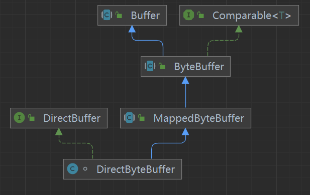

# NIO 全异步

[java3y nio介绍](https://mp.weixin.qq.com/s/hw0u_wmiVbZ5-U9xjjPXsg)

[nio http服务器简易实现](https://www.cnblogs.com/xugf/p/9603434.html)

[mapped diretctBuffer区别](https://zthinker.com/archives/directbytebuffer%E4%B8%8Emappedbytebuffer)

[聊聊Netty那些事儿之从内核角度看IO模型](https://mp.weixin.qq.com/s/zAh1yD5IfwuoYdrZ1tGf5Q)

[同步  阻塞解释，NIO非阻塞](https://zhuanlan.zhihu.com/p/27400943)

## 00基础

### Java nio api

很多人说 nio api 是非阻塞的，如何理解这句话？

SocketChannel implements ByteChannel

ByteChannel extends ReadableByteChannel

`int read(ByteBuffer dst)` 方法由 ReadableByteChannel 接口定义。当socketChannel.configureBlocking 为FALSE时，sc工作在非阻塞状态，调用read 方法会立刻返回，读回内核缓冲区数据，如果缓冲区无数据则不会拷贝任何数据到ByteBuffer。

这种使用场景，我们需要线程自旋不断去读，直到读完我们想要的数据为止，期间线程没有出现阻塞，即“同步非阻塞”。实际不会用这种模型。nio阻塞可能指的是这里？

>A read operation might not fill the buffer, and in fact it might not read any bytes at all. Whether or not it does so depends upon the nature and state of the channel. A socket channel in non-blocking mode, for example, cannot read any more bytes than are immediately available from the socket's input buffer; similarly, a file channel cannot read any more bytes than remain in the file. It is guaranteed, however, that if a channel is in blocking mode and there is at least one byte remaining in the buffer then this method will block until at least one byte is read.

正常基于Selector 监听CHANEL状态，当状态就绪时，在去读，使用的是IO多路复用模型

#### Buffer

Java nio api使用Buffer作为数据容器，读操作时，将内核数据拷贝到Buffer中，写操作时 将Buffer数据拷贝到内核空间。

Buffer是一大片数据，也就是说IO 时不是单字节，自带缓存，减少了频繁的系统调用。

Buffer 存在两种类型，Direct buffer , non Direct Buffer.

Direct Buffer 内部使用 jvm堆外内存，内存首地址稳定，其空间不像普通Java对象那样被GC管理，有使用panda  refference.

IO时可减少一次 内存copy过程。该段内存可以直接传递给操作系统IO函数。性能有提升

Heap Buffer 仍然使用jvm heap空间，由于存在GC，其内存地址不稳定，无法直接用于底层IO。当做IO 时，会在堆外申请临时内存块，将Buffer中数据拷贝过去，然后将临时内存块欧用于内核IO。

在使用CHANEL进行IO时，传入的是 父类引用变量Buffer。channel如果识别出Direct并避免一次不必要内存拷贝？

看了FileChannelImp可知，内部使用了instanceOf关键字来判断Buffer是否为Direct类型。如果是走单独处理分支，分支会将Buffer强转成DirectBuffer接口类，该接口类提供了堆外内存的首地址（也就是说DirectBuffer 类必须都实现DirectBuffer J接口，否则会抛RunTimeException）

MappedByteBuffer 抽象类 DirectByteBuffer

MappedByteBuffer 表示该类用于文件内存映射（文件在内核空间中地址和 用户空间缓存地址 共用一片物理内存，系统IO时不用将用户空间数据拷贝到内核缓存区，高效）。

DirectByteBuffer 仅仅表示一个堆外内存空间，为啥用继承MappedByteBuffer，这个有点令人费解。网上有人解释，DirectBuffer作为可以实例化的子类，在FileChannel场景充当了MappedBuffer实例，提供了内存映射文件的功能。也就是说我们在使用DirectBuffer时很少它作为MappedBuffer的功能。

ByteBuffer IntBuffer 区别，场景

#### selector 

socket场景，我们可以使用 一个selector 监听多个Channel的事件（内部使用IO复用模型，单线程监听多个socket状态），当事件到达时，意味着内核数据已经就绪，selector的调用线程从阻塞中被唤醒，这个时候我们可以遍历所有channel事件，存在读事件则 可以使用channel把数据 读到Buffer当中，（内部进行了内核数据到用户空间的拷贝，是阻塞的？）。那么这个过程是我们用户线程是完成的，我们可以使用一个新线程去处理，并非内核线程去操作或者回调的。

面对高QPS场景，我们该如何使用线程 构建一个IO handle 模型？区别传统BIO 处理模型？

Reactor 模型，使用多个Selector 来提高吞吐和多核利用率？

IO复用 + 事件回调机制？ 

全异步？

正常的异步IO是内核线程回调钩子函数完成通知。

#### channel

#### SelectionKey

表示Channel在Selector的注册。可添加 InternetOps  attachment。

## 01Reactor 模式

[疯狂创客圈reactor介绍](https://www.cnblogs.com/crazymakercircle/p/9833847.html#autoid-h4-7-1-1)

1. Reactor + Handler 单线程Reactor模型

2. Reactor（单线程） + MthreadHandler （线程池）
3. MultiReactor(单线程 ? 是否有问题，可设计成多线程？) + MthreadHandler(线程池)

底层io模型使用的 多路复用，

（1）主线程阻塞问询selecor是否有事件可用，并调用对应handler 处理。

（2）当有可用的 connection event时，handler从serverSocketChannel获取代表客户端连接的SocketChanel 。将 socketChannel注册到Selector上，监听读可用事件。

（3）当有可用的 read event时，读取到完整报文，则进行业务处理，生成响应报文，进行写操作

步骤1 可以使用多个 reactor
步骤3 可使用多线程处理

## Linux IO 模型

## 04 其他

http nio server 如何识别一个完整http请求，如果多个tcp组成一个完整的http请求，服务端该如何识别？如何确定Buffer的长度，如果Buffer的长度不够，怎么办？

1. 大多数时候，读可用时是否意味着一组tcp报文完整到达？程序如何判断http 请求报文已完整到达？

如何验证这一猜测和假设，http 请求中是否有字段描述 本次请求的长度？https://www.zhihu.com/question/61383567