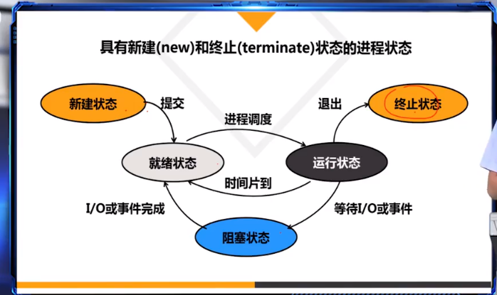
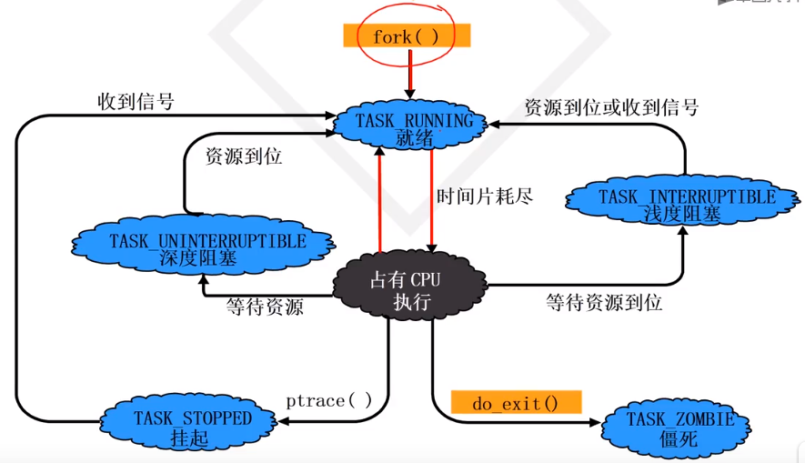
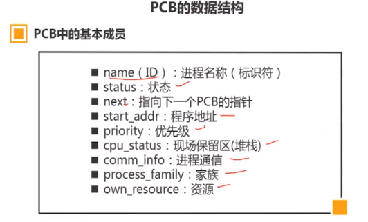
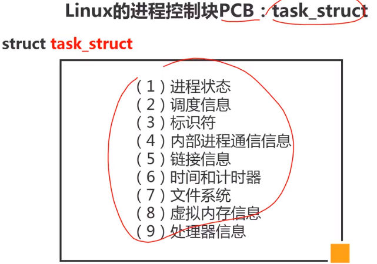
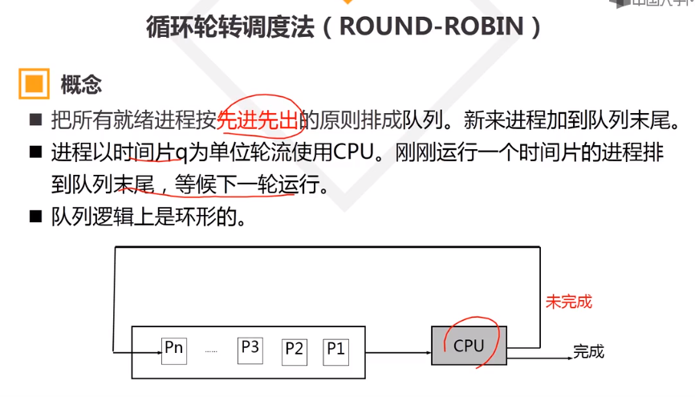

# 操作系统原理

>https://blog.csdn.net/justloveyou_/article/details/78304294

## 进程

### 1. 进程状态

### PCB进程控制块

进程＝程序＋PCB

1. 数据结构

## 进程 线程

### 1. 进程与线程基本区别

进程是代码的一次运行过程。进程是OS分配资源的基本单位；
 线程是进程中的一个代码执行流，是CPU任务调度的基本单位。每个进程至少有一个线程，同进程的多个线程共享进程的资源和地址空间。线程自己基本上不拥有系统资源,只拥有一点在运行中必不可少的资源(如函数调用栈，程序计数器,一组寄存器和栈)；

### 2. 进程之间通信方式

* 管道（pipe）及命名管道（named pipe）：管道可用于具有亲缘关系的父子进程间的通信，有名管道除了具有管道所具有的功能外，它还允许无亲缘关系进程间的通信；
* 信号（signal）：信号是一种比较复杂的通信方式，用于通知接收进程某个事件已经发生；
* 信号量：主要作为进程之间及同一种进程的不同线程之间得同步和互斥手段；
* 套接字：这是一种更为一般得进程间通信机制，它可用于网络中不同机器之间的进程间通信，应用非常广泛
* 消息队列：消息队列是消息的链接表，它克服了上两种通信方式中信号量有限的缺点，具有写权限得进程可以按照一定得规则向消息队列中添加新信息；对消息队列有读权限得进程则可以从消息队列中读取信息；
* 共享内存：可以说这是最有用的进程间通信方式。它使得多个进程可以访问同一块内存空间，不同进程可以及时看到对方进程中对共享内存中数据得更新。这种方式需要依靠某种同步操作，如互斥锁和信号量等；

### 3. 线程同步方式

* **互斥锁（mutex）**
  锁机制是同一时刻只允许一个线程执行一个关键部分的代码。适合可用资源唯一的情景.

* **条件变量(与互斥量配合使用)**

互斥量防止多个线程同时访问同一共享变量。条件变量则是在此之外的拾遗补缺。条件变量允许一个线程就某个共享变量（或其他共享资源）的状态变化通知其他线程，并让其他线程等待（堵塞于）这一通知。条件变量总是结合互斥量使用。条件变量就共享变量的状态改变发出通知，而互斥量则提供对该共享变量访问的互斥。

* **信号量**

适合有多个可用资源场景

### 4. 进程有关

1. 上下文切换 做了什么

1. 系统调用；进程虚拟地址空间；用户态 内核态
* 系统调用
提供给应用程序调用，用于请求OS内核服务的一组接口。内核通过提供系统调用为应用程序提供服务，系统调用是应用程序与OS内核之间交互的唯一方式。~~为了保护OS内核系统进程安全，~~系统调用基于软中断实现，执行系统调用时触发中断服务函数，应用程序会从用户态进入内核态。

* 用户空间/态 内核空间/态
32位Linux系统中，每个用户进程拥有4G大小的虚拟地址空间，虚拟空间被分成用户空间（地址较高的1GB区域）、内核空间（剩余3GB区域）两个区块。内核空间映射内核的代码和数据，内核空间代码运行在CPU高特权级别，可以访问所有受保护内存空间和底层硬件设备。用户空间映射用户自己编写的代码，用户空间代码运行在CPU低特权级别。
（1）当一个任务（进程）执行系统调用而陷入内核代码中执行时，称进程处于内核运行态（内核态）。
（2）当进程在执行用户自己的代码时，则称其处于用户运行态（用户态）。
* 进程虚拟地址空间
程序路径：完整的绝对路径字符串如 “/home/simba/code/asm/simple”
环境变量：类似linux下的PATH,HOME等的环境变量，子进程会继承父进程的环境变量。
命令行参数：类似ls -l 中-l 就是命令行参数，而ls 就是可执行程序。
栈：就是堆栈，程序运行时需要在这里做数据运算，存储临时数据，开辟函数栈等。在Linux下，栈是高地址往低地址增长的。对于函数栈来说，函数运行完毕就释放内存，举例递归来说，递归太多层的话很可能造成栈溢出。局部变量（不包含静态变量）；局部可读变量(const)都分配在栈上。
共享库和mmap内存映射区：函数共享库固定在某个物理内存位置上，让许多进程映射共享。mmap是个系统函数，可以把磁盘文件的一部分直接映射到内存，这样文件中的位置直接就有对应的内存地址，对文件的读写可以直接用指针来做而不需要read/write函数。
堆：即malloc申请的内存，使用free释放，如果没有主动释放，在进程运行结束时也会被释放。
BSS Segment：未初始化全局变量、静态局部变量
数据段 Data Segment: 初始化过的全局变量、静态局部变量
文本段Text Segment: 可执行程序（二进制）(.text)；全局初始化只读变量（const）(.rodata)；字符串常量（.rodata)；

4. 缺页异常
5. 页面置换算法

FIFO先进先出算法：在操作系统中经常被用到，比如作业调度（主要实现简单，很容易想到）；

LRU（Least recently use）最近最少使用算法：根据使用时间到现在的长短来判断；

LFU（Least frequently use）最少使用次数算法：根据使用次数来判断；

OPT（Optimal replacement）最优置换算法：理论的最优，理论；就是要保证置换出去的是不再被使用的页，或者是在实际内存中最晚使用的算法

6. **操作系统中进程调度策略**

FCFS(先来先服务，队列实现，非抢占的)：先请求CPU的进程先分配到CPU

SJF(最短作业优先调度算法)：平均等待时间最短，但难以知道下一个CPU区间长度

优先级调度算法(可以是抢占的，也可以是非抢占的)：优先级越高越先分配到CPU，相同优先级先到先服务，存在的主要问题是：低优先级进程无穷等待CPU，会导致无穷阻塞或饥饿；解决方案：老化

时间片轮转调度算法(可抢占的)：队列中没有进程被分配超过一个时间片的CPU时间，除非它是唯一可运行的进程。如果进程的CPU区间超过了一个时间片，那么该进程就被抢占并放回就绪队列。

多级队列调度算法：将就绪队列分成多个独立的队列，每个队列都有自己的调度算法，队列之间采用固定优先级抢占调度。其中，一个进程根据自身属性被永久地分配到一个队列中。

多级反馈队列调度算法：与多级队列调度算法相比，其允许进程在队列之间移动：若进程使用过多CPU时间，那么它会被转移到更低的优先级队列；在较低优先级队列等待时间过长的进程会被转移到更高优先级队列，以防止饥饿发生。

### 5. 线程有关

1. 生产者 消费者模型

## 死锁

1. 死锁的概念

　　在两个或者多个并发进程中，如果每个进程持有某种资源而又等待其它进程释放它或它们现在保持着的资源，在未改变这种状态之前都不能向前推进，称这一组进程产生了死锁。通俗的讲，就是两个或多个进程无限期的阻塞、相互等待的一种状态。

2. 死锁产生的四个必要条件

互斥：至少有一个资源必须属于非共享模式，即一次只能被一个进程使用；若其他申请使用该资源，那么申请进程必须等到该资源被释放为止；

占有并等待：一个进程必须占有至少一个资源，并等待另一个资源，而该资源为其他进程所占有；

非抢占：进程不能被抢占，即资源只能被进程在完成任务后自愿释放

循环等待：若干进程之间形成一种头尾相接的环形等待资源关系

3. 死锁的处理基本策略和常用方法

　　解决死锁的基本方法主要有 预防死锁、避免死锁、检测死锁、解除死锁 、鸵鸟策略 等。

　　(1). 死锁预防
　　
　　死锁预防的基本思想是 只要确保死锁发生的四个必要条件中至少有一个不成立，就能预防死锁的发生，具体方法包括：

打破互斥条件：允许进程同时访问某些资源。但是，有些资源是不能被多个进程所共享的，这是由资源本身属性所决定的，因此，这种办法通常并无实用价值。

打破占有并等待条件：可以实行资源预先分配策略(进程在运行前一次性向系统申请它所需要的全部资源，若所需全部资源得不到满足，则不分配任何资源，此进程暂不运行；只有当系统能满足当前进程所需的全部资源时，才一次性将所申请资源全部分配给该线程)或者只允许进程在没有占用资源时才可以申请资源（一个进程可申请一些资源并使用它们，但是在当前进程申请更多资源之前，它必须全部释放当前所占有的资源）。但是这种策略也存在一些缺点：在很多情况下，无法预知一个进程执行前所需的全部资源，因为进程是动态执行的，不可预知的；同时，会降低资源利用率，导致降低了进程的并发性。

打破非抢占条件：允许进程强行从占有者哪里夺取某些资源。也就是说，但一个进程占有了一部分资源，在其申请新的资源且得不到满足时，它必须释放所有占有的资源以便让其它线程使用。这种预防死锁的方式实现起来困难，会降低系统性能。

打破循环等待条件：实行资源有序分配策略。对所有资源排序编号，所有进程对资源的请求必须严格按资源序号递增的顺序提出，即只有占用了小号资源才能申请大号资源，这样就不回产生环路，预防死锁的发生。

　　(2). 死锁避免的基本思想
　　
　　死锁避免的基本思想是动态地检测资源分配状态，以确保循环等待条件不成立，从而确保系统处于安全状态。所谓安全状态是指：如果系统能按某个顺序为每个进程分配资源（不超过其最大值），那么系统状态是安全的，换句话说就是，如果存在一个安全序列，那么系统处于安全状态。资源分配图算法和银行家算法是两种经典的死锁避免的算法，其可以确保系统始终处于安全状态。其中，资源分配图算法应用场景为每种资源类型只有一个实例(申请边，分配边，需求边，不形成环才允许分配)，而银行家算法应用于每种资源类型可以有多个实例的场景。

　　(3). 死锁解除

　　死锁解除的常用两种方法为进程终止和资源抢占。所谓进程终止是指简单地终止一个或多个进程以打破循环等待，包括两种方式：终止所有死锁进程和一次只终止一个进程直到取消死锁循环为止；所谓资源抢占是指从一个或多个死锁进程那里抢占一个或多个资源，此时必须考虑三个问题：

　　(I). 选择一个牺牲品
　　(II). 回滚：回滚到安全状态
　　(III). 饥饿（在代价因素中加上回滚次数，回滚的越多则越不可能继续被作为牺牲品，避免一个进程总是被回滚）

