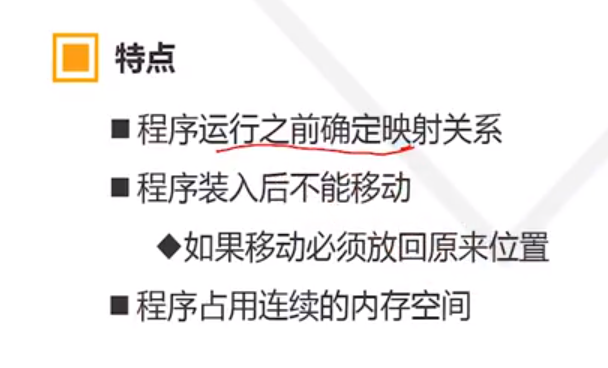

## 一 内存管理功能

###  1. 地址映射

VA：virtual addr

BA: base addr

MA:memory addr

1. 静态地址映射

 

2. 动态地址映射

​     

  

### 2.  虚拟内存

### 3.  内存分配

###  4.  存储保护 

## 二 物理内存管理

### 1. 分区存储管理

1. 固定分区

2. 动态分区

   

### 2. 分区放置策略

1. 空闲分区表
2. 放置策略 （空闲区表排序原则）

3. 分区回收

考虑释放区与现有空闲区是否相连？

### 3. 内存覆盖技术

### 4. 内存交换技术

### 5. 内存碎片管理

## 三  虚拟内存管理

****

### 1. 页式虚拟内存管理概念

 

### 2. 页表和页式地址映射

 

页表地址映射

 

### 3. 快表技术和页面共享技术

 

### 4.  缺页中断

 

### 5. 页面淘汰策略

  

### 6. 缺页因素和页式系统缺点

### 7. 段式和段页式虚拟存储

 

 ## Intel CPU 与 Linux 内存管理

