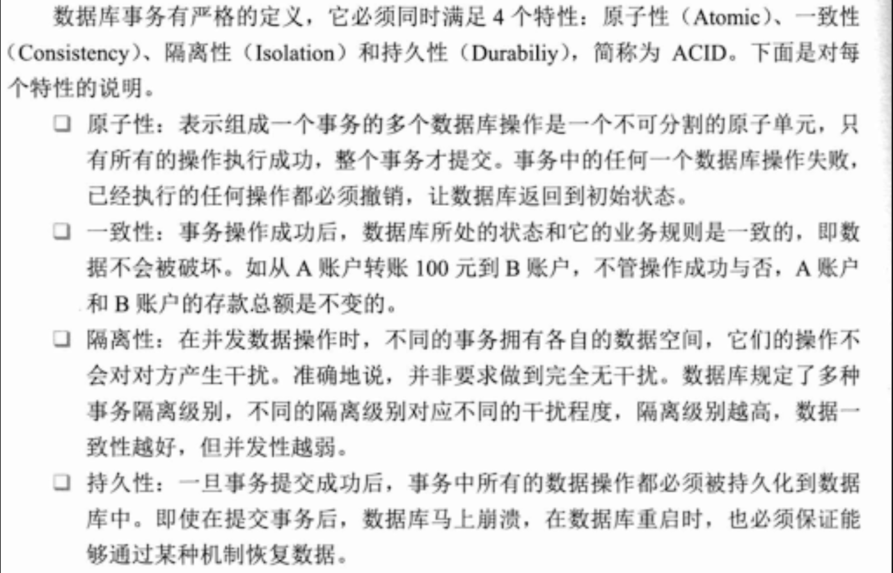
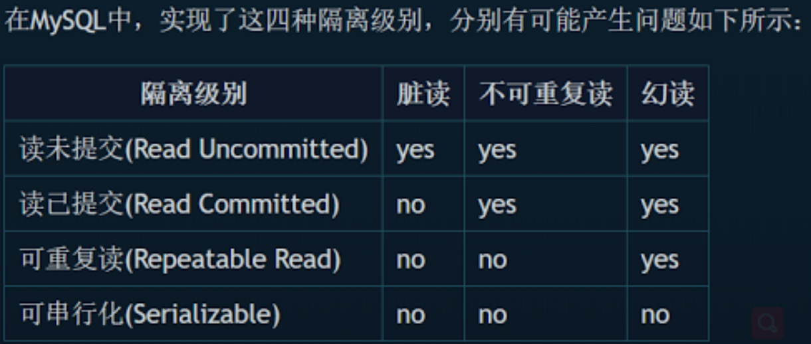
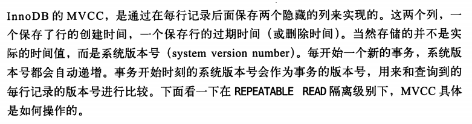
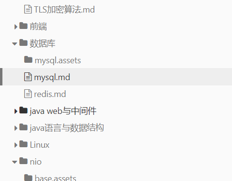

## SQL
### 常用语句
```
#查看字段属性
show columns from tableName;
show create table tableName;
```
### 语句分类

1. DDL（Data Definition Language）数据定义语句，定义不同数据段、数据库、表、列、索引等数据库对象，常见关键字 create 、drop 、alter等。
2. DML (Data Manipulation Language) 数据操纵语句，用于添加、删除、更新和查询数据库记录，并检查数据完整性。 包括insert delete update select等；
4. DCL (Data Control Language) 数据控制语句，用于控制不同数据段的访问权限，定义库、表、字段、用户的访问权限和安全级别。包括grant revoke等。
### select
* distinct
select distinct vend_id from products
* limit
存在**第0行**

``` 
limit 3  #返回不多于3行 
limit 3,4 # 返回从行3开始的4行
limit 4 offset 3 # 返回从行3开始的4行 存在第0行
```

2. order by
select  *  from tab1 order by col1 DESC,col2   
#col1值相同的行用col2进行排序
DESC (DESCENDING) 降序 只与前面的一列绑定
### where
1. 基本操作符

| 操作符          | 说明                       |
| --------------- | -------------------------- |
| <>   !=         | 都表示不等于               |
| between A and B | 要求值属于A B之间，包括A B |
| is null         | 值为空                     |
| in(A,B,C)       | 值必须属于该集合           |

2. like 操作符
> like子句 匹配整个列
* %通配符
任何字符出现任何次数
jet% 以jet开头的字符串
%jet% 中间包含jet 的字符串
* _通配符
只匹配一个字符，不能为空

3. 正则表达式


### 计算字段
>数据表字段不是应用程序要求的格式，可使用计算字段进行转换
1. 计算字段
	要求字符串全大写
	select upper(vend_name) from vendors
	```
	常见文本处理函数
	left() right()
	length() locate()
	lower() upper()
	Ltrim() Rtrim() 
	```

	```
	常见日期和时间处理函数
	Date() 返回日期时间字段中的日期部分
	Time() 返回日期时间字段中的时间部分
	描述一个时间常量，使用 ‘yyyy-mm-dd’格式
	```
2. 拼接字段
把值连接在一起构成单值
select CONCAT(vend_name,'(',RTRIM(vend_country),')') ==as== vend_title from vendors;
3. 算术字段
select A,B,**A*B** as sum from tableA

### 聚集函数
> 只能运行在分组上，计算和返回单个值的函数
```
AVG() COUNT() MAX() MIN() SUM()
```

### 分组
group by 对数据进行分组 having 过滤分组
使用group by 后，只能select 分组用的字段或者聚集函数的值（对每个分组单独聚集，每个组用一条记录表示）

###  子查询
1. 利用子查询进行过滤
2. 作为计算字段使用子查询

### 联结
1. 内部联结 inner join
    不符合联结条件的列不会被列出来

2. 外部联结 outer join
    获取所有客户的订单，没有订单的客户也要列出来
```sql
select c.cust_id,o.order_num 
from customers c 
left join orders o on c.cust_id=o.cust_id
```

### 其他语句
增加记录：
insert into tableName(col1,col2)  values (val1,val2),(val11,val22) 
更新记录：
update tableName set colName=colValue where colName=colValue
删除记录：
delete from tableName where colName=colValue

### 操作 table schema

## 数据类型

1. 字符串
2. 整型
3. 浮点型
4. 日期时间类型
5. BLOB ?


## B树/B-树
[参考博客](https://www.cnblogs.com/nullzx/p/8729425.html)
1. B树的定义
B树也称B-树,它是一颗多路**平衡**查找树。我们描述一颗B树时需要指定它的阶数，**阶数表示了一个结点最多有多少个孩子结点**，一般用字母m表示阶数。当m取2时，就是我们常见的二叉搜索树。。当m取3时，就是2-3树。
一颗m阶的B树定义如下：
1）每个结点最多有m-1个关键字。
2）根结点最少可以只有1个关键字。
3）非根结点至少有Math.ceil(m/2)-1个关键字。
4）每个结点中的关键字都按照从小到大的顺序排列，每个关键字的左子树中的所有关键字都小于它，而右子树中的所有关键字都大于它。
5）所有叶子结点都位于同一层，或者说根结点到每个叶子结点的长度都相同。
2. 疑问
* B树中，用于描述单个节点的数据结构的空间大小是否是固定定死的？即使 有的节点的关键字个数未达到m-1，但是空间已经固定下来，可以存放m-1条记录。

## B+树
[参考博客](https://ivanzz1001.github.io/records/post/data-structure/2018/06/16/ds-bplustree#11-b%E6%A0%91%E7%9A%84%E5%AE%9A%E4%B9%89)
`B+树`是一种数据结构，是一个N叉排序树，每个节点通常有多个孩子，一棵`B+树`包含根节点、内部节点和叶子节点。根节点可能是一个叶子节点， 也可能是一个包含两个或两个以上孩子节点的节点。
`B+树`通常用于数据库和操作系统的`文件系统`中。NTFS、ReiserFS、NSS、XFS、JFS、ReFS和BFS等文件系统都在使用`B+树`作为元数目索引。`B+树`的特点是能够保持数据稳定有序， 其插入与修改拥有较稳定的对数时间复杂度。`B+树`元素自底向上插入。
1. B+树的定义

`B+树`是应文件系统所需而出的一种`B-树`的变型树。一棵`m阶`的`B+树`和m阶的`B-树`的差异在于：
**1)**  有n棵子树的节点中含有n个关键字(即每个关键字对应一棵子树)；
**2)**  所有叶子节点中包含了全部关键字的信息， 及指向含这些关键字记录的指针，且叶子节点本身依关键字的大小自小而大顺序链接；
**3)**  所有的非叶子节点可以看成是索引部分，节点中仅含有其子树（根节点）中的最大（或最小)关键字
**4)**  除根节点外，其他所有节点中所含关键字的个数必须`>=⌈m/2⌉`(注意：  `B-树`是除根以外的所有非终端节点至少有`⌈m/2⌉`棵子树)

## 索引
### 聚簇索引 clustering index
我们上边介绍的 B+ 树本身就是一个目录，或者说本身就是一个索引。它有两个特点：  
1. 使用记录**主键值**的大小进行记录和页的排序，这包括三个方面的含义：  
* 页内的记录是按照主键的大小顺序排成一个单向链表。  
* 各个存放用户记录的页也是根据页中用户记录的主键大小顺序**排成一个双向链表**。  
* 存放目录项记录的页分为不同的层次，在同一层次中的页也是根据页中目录项记录的主键大  
小顺序排成一个双向链表。  
2. B+ 树的叶子节点存储的是**完整的用户记录**。  
所谓完整的用户记录，就是指这个记录中存储了所有列的值（包括隐藏列）。  
我们把具有这两种特性的 B+ 树称为 聚簇索引 ，所有完整的用户记录都存放在这个 聚簇索引 的叶子节点处。这种 聚簇索引 并不需要我们在 MySQL 语句中显式的使用 INDEX 语句去创建（后边会介绍索引相关的语句）， InnoDB 存储引擎会自动的为我们创建聚簇索引。另外有趣的一点是，在 InnoDB 存储引擎中， 聚簇索引 就是数据的存储方式（所有的用户记录都存储在了 叶子节点 ），也就是所谓的索引即数据，数据即索引。
### 二级索引 辅助索引
按照 非主键列 建立的 B+ 树  需要一次 **回表** 操作才可以定位到完整的用户记录，所以这种 B+ 树也被称为 **二级索引** （英文名  secondary index ），或者 辅助索引 。
这个 B+ 树与上边介绍的聚簇索引有几处不同：  

* 使用记录 c2 列的大小进行记录和页的排序，这包括三个方面的含义：  
	* 页内的记录是按照 c2 列的大小顺序排成一个单向链表。  
	* 各个存放用户记录的页也是根据页中记录的 c2 列大小顺序排成一个双向链表。  
	* 存放目录项记录的页分为不同的层次，在同一层次中的页也是根据页中目录项记录的 c2 列大小顺序排成一个双向链表。  
* **B+ 树的叶子节点存储的并不是完整的用户记录，而只是 c2列+主键 这两个列的值。**  
* 目录项记录中不再是 主键+页号 的搭配，而变成了 c2列+页号 的搭配。

### 联合索引
我们也可以同时以多个列的大小作为排序规则，也就是同时为多个列建立索引，比方说我们想让 B+ 树  按照 c2 和 c3 列的大小进行排序，这个包含两层含义：  
* 先把各个记录和页按照 c2 列进行排序。  
* 在记录的 c2 列相同的情况下，采用 c3 列进行排序

### 聚集索引 非聚集索引区别

### 哈希索引
>Hash索引结构的特殊性，其检索效率非常高，索引的检索可以一次定位;
>B+树索引需要从根节点到枝节点，最后才能访问到页节点这样多次的IO访问;
>那为什么大家不都用Hash索引而还要使用B+树索引呢？

1. 哈希索引
- Hash索引仅仅能满足"=","IN"和"<=>"查询，不能使用范围查询,因为经过相应的Hash算法处理之后的Hash值的大小关系，并不能保证和Hash运算前完全一样；
- Hash索引无法被用来避免数据的排序操作，因为Hash值的大小关系并不一定和Hash运算前的键值完全一样；
- Hash索引不能利用部分索引键查询，对于组合索引，Hash索引在计算Hash值的时候是组合索引键合并后再一起计算Hash值，而不是单独计算Hash值，所以通过组合索引的前面一个或几个索引键进行查询的时候，Hash索引也无法被利用；
- Hash索引在任何时候都不能避免表扫描，由于不同索引键存在相同Hash值，所以即使取满足某个Hash键值的数据的记录条数，也无法从Hash索引中直接完成查询，还是要回表查询数据；
- Hash索引遇到大量Hash值相等的情况后性能并不一定就会比B+树索引高。

2. B+Tree索引

MySQL中，只有HEAP/MEMORY引擎才支持Hash索引。

常用的InnoDB引擎中默认使用的是B+树索引，它会实时监控表上索引的使用情况，如果认为建立哈希索引可以提高查询效率，则自动在内存中的“自适应哈希索引缓冲区”建立哈希索引（在InnoDB中默认开启自适应哈希索引），通过观察搜索模式，MySQL会利用index key的前缀建立哈希索引，如果一个表几乎大部分都在缓冲池中，那么建立一个哈希索引能够加快等值查询。

3. B+树索引和哈希索引的明显区别是：

- 如果是等值查询，那么哈希索引明显有绝对优势，因为只需要经过一次算法即可找到相应的键值；当然了，这个前提是，键值都是唯一的。如果键值不是唯一的，就需要先找到该键所在位置，然后再根据链表往后扫描，直到找到相应的数据；

- 如果是范围查询检索，这时候哈希索引就毫无用武之地了，因为原先是有序的键值，经过哈希算法后，有可能变成不连续的了，就没办法再利用索引完成范围查询检索；

- 同理，哈希索引没办法利用索引完成排序，以及like ‘xxx%’ 这样的部分模糊查询（这种部分模糊查询，其实本质上也是范围查询）；

- 哈希索引也不支持多列联合索引的最左匹配规则；

B+树索引的关键字检索效率比较平均，不像B树那样波动幅度大，在有大量重复键值情况下，哈希索引的效率也是极低的，因为存在所谓的哈希碰撞问题。
在大多数场景下，都会有范围查询、排序、分组等查询特征，用B+树索引就可以了。

## 事务
### ACID 四大特性

1. **原子性（Atomicity）**
 原子性是指事务包含的所有操作要么全部成功，要么全部失败，回滚到事务发生前状态。不存在中间状态。

 2. **一致性（Consistency）**
    事务开始前和结束后，数据库的完整性约束没有被破坏

3. **隔离性（Isolation）**
    并发的事务会被隔离，互不干扰。数据库提供不同的隔离级别，不同隔离级别提供不同干扰程度。

4. **持久性（Durability）**
    持久性是指一个事务一旦被提交了，那么对数据库中的数据的改变就是永久性的，即便是在数据库系统遇到故障的情况下也不会丢失提交事务的操作。

  目前主要有两种方式实现ACID：第一种是Write ahead logging，也就是日志式的方式(现代数据库均基于这种方式)。第二种是Shadow paging。WAL 的中心思想是对数据文件 的修改（它们是表和索引的载体）必须是只能发生在这些修改已经 记录了日志之后 -- 也就是说，在日志记录冲刷到永久存储器之后． 如果我们遵循这个过程，那么我们就不需要在每次事务提交的时候 都把数据页冲刷到磁盘，因为我们知道在出现崩溃的情况下， 我们可以用日志来恢复数据库：任何尚未附加到数据页的记录 都将先从日志记录中重做（这叫向前滚动恢复，也叫做 REDO） 然后那些未提交的事务做的修改将被从数据页中删除 （这叫向后滚动恢复 - UNDO）。

### 数据并发问题

#### 读有关

1、**脏读**：事务A读取了事务B更新的数据，然后B回滚操作，那么A读取到的数据是脏数据

2、**不可重复读**：事务 A 多次读取同一数据，事务 B 在事务A多次读取的过程中，对数据作了更新并提交，导致事务A多次读取同一数据时，结果因此本事务先后两次读到的数据结果会不一致。

3、**幻读**：幻读解决了不重复读，保证了同一个事务里，查询的结果都是事务开始时的状态（一致性）。

例如：事务T1对一个表中所有的行的某个数据项做了从“1”修改为“2”的操作 这时事务T2又对这个表中插入了一行数据项，而这个数据项的数值还是为“1”并且提交给数据库。 而操作事务T1的用户如果再查看刚刚修改的数据，会发现还有跟没有修改一样，其实这行是从事务T2中添加的，就好像产生幻觉一样，这就是发生了幻读。

**小结**：不可重复读的和幻读很容易混淆，不可重复读侧重于修改，幻读侧重于新增或删除。解决不可重复读的问题只需锁住满足条件的行，解决幻读需要锁表。

####  更新丢失

1. 第一类更新丢失问题。（指一个事务提交失败回滚，导致另一个事务的数据修改被覆盖（即丢失））该类问题已经被现代数据库完全避免。

2. 第二类更新丢失问题。

   B事务覆盖A事务已经提交的数据，造成A事务的操作丢失。该问题无法设置事务隔离解决（除了串行化级别，导致无法并发）。需要自行使用悲观锁或乐观锁解决。

### MySQL事务隔离级别



1.MySQL隔离级别**默认级别是Repeatable Read**

2.设置事务隔离级别

```
-- 取消autocommit
set autocommit=0
show variables like "%autocommit%";
 
-- 查看隔离级别
SELECT @@global.tx_isolation;
SELECT @@session.tx_isolation;
SELECT @@tx_isolation;
 
show variables like '%iso%';
+---------------+-----------------+
| Variable_name | Value           |
+---------------+-----------------+
| tx_isolation  | REPEATABLE-READ |
+---------------+-----------------+
 
show global variables like '%iso%';
+---------------+-----------------+
| Variable_name | Value           |
+---------------+-----------------+
| tx_isolation  | REPEATABLE-READ |
+---------------+-----------------+
 
-- 设置隔离级别
SET SESSION TRANSACTION ISOLATION LEVEL read uncommitted;
SET SESSION TRANSACTION ISOLATION LEVEL read committed;
SET SESSION TRANSACTION ISOLATION LEVEL repeatable read;
SET SESSION TRANSACTION ISOLATION LEVEL serializable;
 
-- 事务操作
start transaction;
SELECT * FROM text.tx;
commit;
 
start transaction;
SELECT * FROM text.tx;
update text.tx set num =10 where id = 1;
insert into text.tx(id,num) values(9,9);
rollback;
commit;
```
### MVCC (Multi-Version Concurrency Control )

1. 锁
   **读锁：**也叫共享锁、S锁，若事务T对数据对象A加上S锁，则事务T可以读A但不能修改A，其他事务只能再对A加S锁，而不能加X锁，直到T释放A上的S 锁。这保证了其他事务可以读A，但在T释放A上的S锁之前不能对A做任何修改。
   **写锁：**又称排他锁、X锁。若事务T对数据对象A加上X锁，事务T可以读A也可以修改A，其他事务不能再对A加任何锁，直到T释放A上的锁。这保证了其他事务在T释放A上的锁之前不能再读取和修改A。
   **表锁：**操作对象是数据表。Mysql大多数锁策略都支持，是系统开销最低但并发性最低的一个锁策略。事务t对整个表加读锁，则其他事务可读不可写，若加写锁，则其他事务增删改都不行。
   **行级锁：**操作对象是数据表中的一行。是MVCC技术用的比较多的。行级锁对系统开销较大，但处理高并发较好。

2. MySQL 可重复读 隔离级别 基于 多版本并发控制机制 实现。

   MVCC的实现，通过保存数据在某个时间点的快照来实现的。这意味着一个事务无论运行多长时间，在同一个事务里能够看到数据一致的视图。根据事务开始的时间不同，同时也意味着在同一个时刻不同事务看到的相同表里的数据可能是不同的。

   

   MVCC使得大部分支持行锁的事务引擎，不再单纯的使用行锁来进行数据库的并发控制，取而代之的是把数据库的行锁与行的多个版本结合起来，只需要很小的开销,就可以实现**非锁定读**，从而大大提高数据库系统的并发性能。

next-key locking（间隙锁） 策略防止幻读。 

### 乐观锁 悲观锁

[参考博客]: https://juejin.im/post/5b4977ae5188251b146b2fc8

1. 悲观锁（Pessimistic Lock）

**悲观锁的特点是先获取锁，再进行业务操作**，即“悲观”的认为并发操作非常容易出现。**通常所说的“一锁二查三更新”即指的是使用悲观锁。通常来讲在数据库上的悲观锁需要数据库本身提供支持，即通过常用的select … for update操作来实现悲观锁**。当数据库执行select for update时会获取被select中的数据行的行锁，因此其他并发执行的select for update如果试图选中同一行则会发生排斥（需要等待行锁被释放），因此达到锁的效果。select for update获取的行锁会在当前事务结束时自动释放，因此**必须在事务中使用**。

这里需要注意的一点是不同的数据库对select for update的实现和支持都是有所区别的，例如oracle支持select for update no wait，表示如果拿不到锁立刻报错，而不是等待，MySQL就没有no wait这个选项。另外**MySQL还有个问题是select for update语句执行中所有扫描过的行都会被锁上，这一点很容易造成问题。因此如果在MySQL中用悲观锁务必要确定走了索引，而不是全表扫描**。

2. 乐观锁（Optimistic Lock）

总是假设最好的情况，每次去拿数据的时候都认为别人不会修改，所以不会上锁，但是在更新的时候会判断一下在此期间别人有没有去更新这个数据，可以使用**版本号机制和CAS算法**实现。**乐观锁适用于多读的应用类型，这样可以提高吞吐量**，像数据库提供的类似于**write_condition机制**，其实都是提供的乐观锁。在Java中`java.util.concurrent.atomic`包下面的原子变量类就是使用了乐观锁的一种实现方式**CAS**实现的。

###  InnoDB、MyISAM、MEMORY区别

1. InnoDB、MyISAM区别
	1. InnoDB**支持事务**，MyISAM不支持，对于InnoDB每一条SQL语言都默认封装成事务，自动提交，这样会影响速度，所以最好把多条SQL语言放在begin和commit之间，组成一个事务；
	2. InnoDB支持**外键**，而MyISAM不支持。对一个包含外键的InnoDB表转为MYISAM会失败；
	3. InnoDB是**聚簇索引**，数据文件是和索引绑在一起的，必须要有主键，通过主键索引效率很高。但是辅助索引需要两次查询，先查询到主键，然后再通过主键查询到数据。因此，主键不应该过大，因为主键太大，其他索引也都会很大。而MyISAM是**非聚簇索引**，索引、数据是分离的（.MYD 数据文件、.MYI索引文件），索引保存的是数据的指针。主键索引和辅助索引是独立的。
	4. InnoDB不保存表的具体行数，执行select count(*) from table时需要全表扫描。而MyISAM用一个变量保存了整个表的行数，执行上述语句时只需要读出该变量即可，速度很快；
	5. Innodb不支持全文索引，而MyISAM支持全文索引，查询效率上MyISAM要高；

2. MEMORY存储引擎

	MEMORY是MySQL中一类特殊的存储引擎。它使用存储在内存中的内容来创建表，而且数据全部放在内存中。这些特性与前面的两个很不同。

	每个基于MEMORY存储引擎的表实际对应一个磁盘文件。该文件的文件名与表名相同，类型为frm类型。该文件中只存储表的结构。而其数据文件，都是存储在内存中，这样有利于数据的快速处理，提高整个表的效率。值得注意的是，服务器需要有足够的内存来维持MEMORY存储引擎的表的使用。如果不需要了，可以释放内存，甚至删除不需要的表。

	MEMORY默认使用哈希索引。速度比使用B型树索引快。当然如果你想用B型树索引，可以在创建索引时指定。注意，MEMORY用到的很少，因为它是把数据存到内存中，如果内存出现异常就会影响数据。如果重启或者关机，所有数据都会消失。因此，基于MEMORY的表的生命周期很短，一般是一次性的。


## 优化

### explain

一条查询语句在经过 MySQL **查询优化器**的各种基于成本和规则的优化会后生成一个所谓的 **执行计划** ，这个执行计划展示了接下来具体执行查询的方式，比如多表连接的顺序是什么，对于每个表采用什么访问方法来具体执行查询等等。设计 MySQL 的大叔贴心的为我们提供了 EXPLAIN 语句来帮助我们查看某个查询语句的具体执行计划，从而可以有针对性的提升我们查询语句的性能。 


###  数据库三范式

>- 所有字段值都是不可分解的原子值。
>- 在一个数据库表中，一个表中只能保存一种数据，不可以把多种数据保存在同一张数据库表中。
>- 数据表中的每一列数据都和主键直接相关，而不能间接相关。

1. 第一范式(确保每列保持原子性)

**第一范式是最基本的范式。如果数据库表中的所有字段值都是不可分解的原子值，就说明该数据库表满足了第一范式**。
第一范式的合理遵循需要根据系统的实际需求来定。比如某些数据库系统中需要用到“地址”这个属性，本来直接将“地址”属性设计成一个数据库表的字段就行。但是如果系统经常会访问“地址”属性中的“城市”部分，那么就非要将“地址”这个属性重新拆分为省份、城市、详细地址等多个部分进行存储，这样在对地址中某一部分操作的时候将非常方便。这样设计才算满足了数据库的第一范式，如下表所示。上表所示的用户信息遵循了第一范式的要求，这样在对用户使用城市进行分类的时候就非常方便，也提高了数据库的性能。

2. 第二范式(确保表中的每列都和主键相关)

第二范式在第一范式的基础之上更进一层。第二范式需要确保数据库表中的每一列都和主键相关，而不能只与主键的某一部分相关（主要针对联合主键而言）。**也就是说在一个数据库表中，一个表中只能保存一种数据，不可以把多种数据保存在同一张数据库表中**。比如要设计一个订单信息表，因为订单中可能会有多种商品，所以要将订单编号和商品编号作为数据库表的联合主键。

3. 第三范式(确保每列都和主键列直接相关,而不是间接相关)

第三范式需要确保数据表中的**每一列数据都和主键直接相关，而不能间接相关**。
比如在设计一个订单数据表的时候，可以将客户编号作为一个外键和订单表建立相应的关系。而不可以在订单表中添加关于客户其它信息（比如姓名、所属公司等）的字段。

## 数据库的读写分离、主从复制


## 非关系型数据库 关系型数据库区别

## 常见面试题

>事务四大特性（ACID）原子性、一致性、隔离性、持久性？
>事务的并发？事务隔离级别，每个级别会引发什么问题，MySQL默认是哪个级别？
>MySQL常见的三种存储引擎（InnoDB、MyISAM、MEMORY）的区别？
>MySQL的MyISAM与InnoDB两种存储引擎在，事务、锁级别，各自的适用场景？
>查询语句不同元素（where、join、limit、group by、having等等）执行先后顺序？
>什么是临时表，临时表什么时候删除?
>MySQL B+Tree索引和Hash索引的区别？
>聚集索引和非聚集索引区别？
>有哪些锁（乐观锁悲观锁），select 时怎么加排它锁？
>非关系型数据库和关系型数据库区别，优势比较？
>数据库三范式，根据某个场景设计数据表？
>数据库的读写分离、主从复制，主从复制分析的 7 个问题？
>使用explain优化sql和索引？
>MySQL慢查询怎么解决？
>什么是 内连接、外连接、交叉连接、笛卡尔积等？
>mysql都有什么锁，死锁判定原理和具体场景，死锁怎么解决？
>varchar和char的使用场景？
>mysql 高并发环境解决方案？
>数据库崩溃时事务的恢复机制（REDO日志和UNDO日志）？


