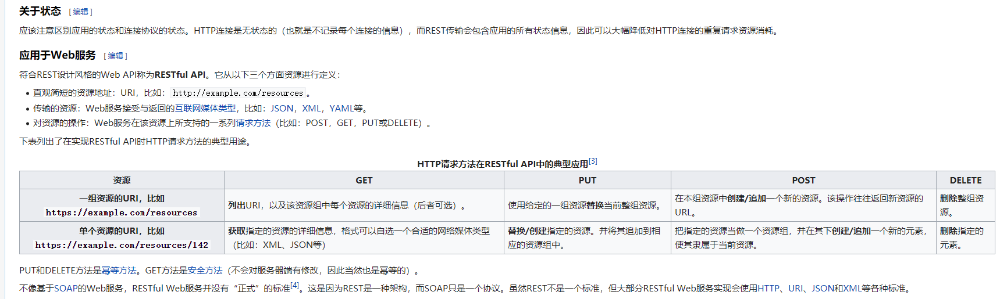
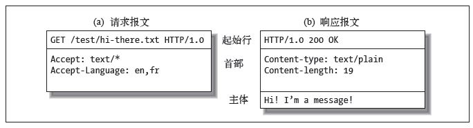
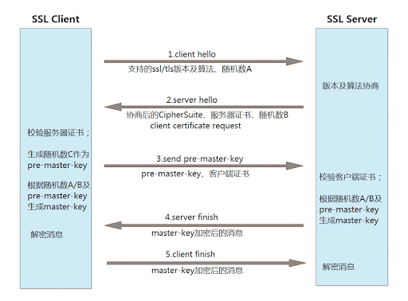
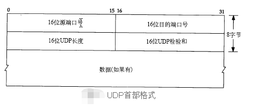
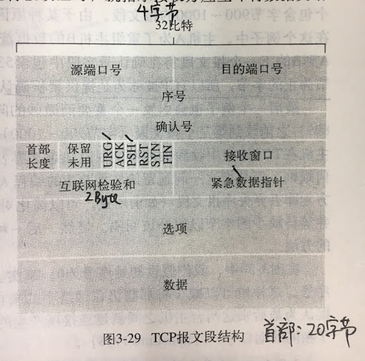
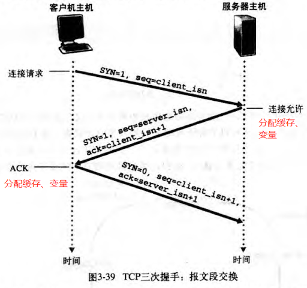
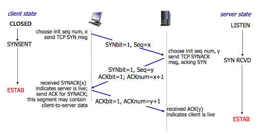
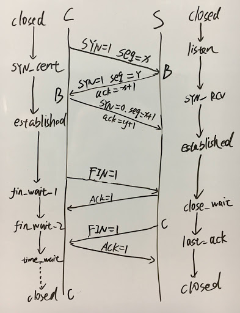
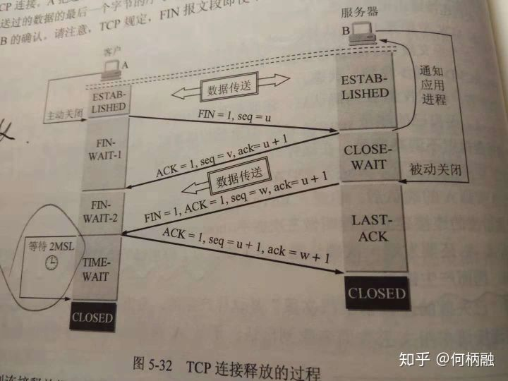
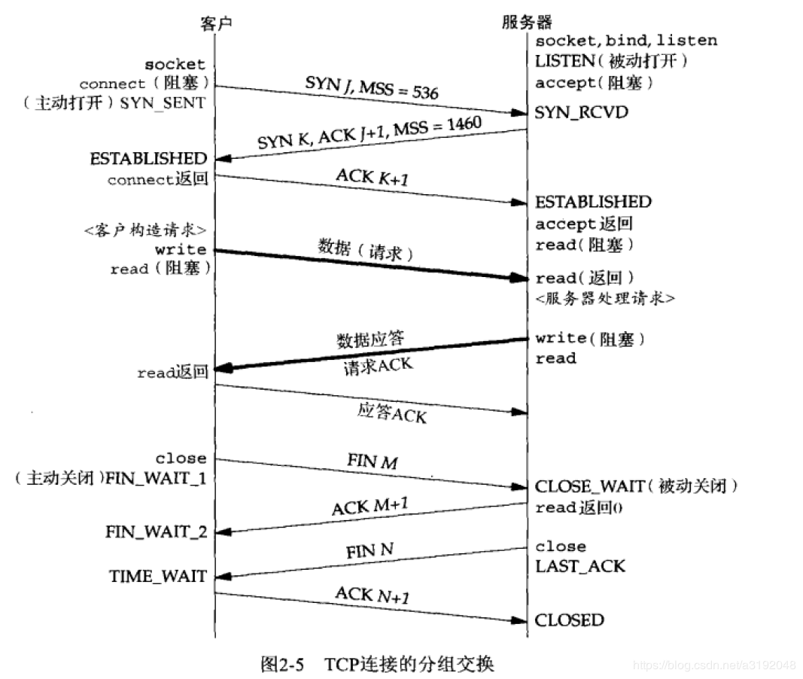

# 计算机网络

## REST

> 维基 [表现层状态转换 ](https://zh.wikipedia.org/wiki/表现层状态转换)

REST是一个软件设计风格，设计符合REST风格的API称为RESTful API。REST包括以下约束、规则：

- 统一接口(Uniform Interface)

1. 以资源为基础

每个资源都可以通过URI访问到。也就是一个个可以认知的资源，比如文档，音乐，视频等信息，都可以通过唯一的URI确定

2. 通过重表达的客户端可以管理原资源，就是我们通过客户端可以修改原资源的状态

3. 返回信息足够描述自己，这样重表达的客户端可以知道如何处理

4. 超媒体是应用状态的引擎，处理以超媒体为基础的状态变化

- Stateless 无状态
- Cacheable 可缓存
- Client-Server 客户端 服务端分离，任何一个客户端、服务端可替换
- Layered System 分层系统
- Code on Demand (optional) 服务器可以将能力扩展到客户端，如果客户端可以执行的话。这个功能是可选择的。

http接口要求：

1. url 描述资源，不用于表达操作，不包含动词
2. get post put delete 分布对应 查 增 更 删。

## 幂等性

幂等性：就是用户对于同一操作发起的一次请求或者多次请求的结果是一致的，不会因为多次点击而产生了副作用

比较容易混淆的是HTTP POST和PUT。POST和PUT的区别容易被简单地误认为“POST表示创建资源，PUT表示更新资源”；而实际上，二者均可用于创建资源，更为本质的差别是在幂等性方面。在HTTP规范中对POST和PUT是这样定义的：

> The POST method is used to request that the origin server accept the entity enclosed in the request as a new subordinate of the resource identified by the Request-URI in the Request-Line ...... If a resource has been created on the origin server, the response SHOULD be 201 (Created) and contain an entity which describes the status of the request and refers to the new resource, and a Location header.
>
> The PUT method requests that the enclosed entity be stored under the supplied Request-URI. If the Request-URI refers to an already existing resource, the enclosed entity SHOULD be considered as a modified version of the one residing on the origin server. If the Request-URI does not point to an existing resource, and that URI is capable of being defined as a new resource by the requesting user agent, the origin server can create the resource with that URI.

POST所对应的URI并非创建的资源本身，而是资源的接收者。比如：POST http://www.forum.com/articles的语义是在http://www.forum.com/articles下创建一篇帖子，HTTP响应中应包含帖子的创建状态以及帖子的URI。两次相同的POST请求会在服务器端创建两份资源，它们具有不同的URI；所以，POST方法不具备幂等性。而PUT所对应的URI是要创建或更新的资源本身。比如：PUT http://www.forum/articles/4231的语义是创建或更新ID为4231的帖子。对同一URI进行多次PUT的副作用和一次PUT是相同的；因此，PUT方法具有幂等性。

在介绍了几种操作的语义和幂等性之后，我们来看看如何通过Web API的形式实现前面所提到的取款功能。很简单，用POST /tickets来实现create_ticket；用PUT /accounts/account_id/ticket_id?amount=xxx来实现idempotent_withdraw。值得注意的是严格来讲amount参数不应该作为URI的一部分，真正的URI应该是/accounts/account_id/ticket_id，而amount应该放在请求的body中。这种模式可以应用于很多场合，比如：论坛网站中防止意外的重复发帖。

## http 协议

>Hyper text trans protocol 超文本传输协议，属于文本协议(ascii码)，无状态协议（stateless protocol）
>###1. 报文格式
>

1. 请求报文
   一般分为三个部分，request line请求行 （\r\n），header 请求头（**\r\n\r\n**），body 请求体。
   请求行：请求方法 URL http版本
   请求方法：
   get  post put delete head options connect trace
   常见请求头：
   Host: www.baidu.com
   User-Agent: Mozilla/4.0
   Connection: Close (Keep-Alive)
   Accept:   Accept-Charset:   Accept_Language:    Accept_Encoding:
   Authorization:  Cookie:  Cookie2:

 * **get报文**
   无body，数据通过请求参数方式包含在URL当中,模板如`/a/a1?k1=v1&k2=v2`，这种方式由于浏览器对URL长度有限制，无法携带大量数据，且数据明文显示在浏览器中。

 * **post报文**
   基本请求头：
    Content-Length:
    Content-Type: 

   1. application/x-www-form-urlencoded;charset=utf-8
   2. multipart/form-data; boundary=----WebKitFormBoundaryrGKCBY7qhFd3TrwA
   3. application/json;charset=utf-8
   4. text/xml text/plain

    有body，数据使用body传输，可传输大文件

2. 响应报文
   包括状态行、头部、主体
   状态行: http版本 状态码  短语
   状态码：

   | 码值 | 含义                                                         |
   | ---- | ------------------------------------------------------------ |
   | 1xx  | 信息性状态码 状态码较新，在HTTP/1.1引入                      |
   | 2xx  | 成功状态码 200 ok请求成功                                    |
   | 3xx  | 重定向状态码                                                 |
   | 4xx  | 客户端错误状态码 客户端发送服务器无法处理的东西。404请求资源不存在 |
   | 5xx  | 服务器错误状态码 客户端发送的是有效请求，服务器自身出错      |

### cookie session 机制

### 其他

1. 持久连接（persistent connection）
   **在HTTP/1.0中，默认使用的是短连接**。也就是说，浏览器和服务器每进行一次HTTP操作，就建立一次连接，但任务结束就拆除连接。如果客户端浏览器访问的某个HTML或其他类型的 Web页中包含有其他的Web资源，如JavaScript文件、图像文件、CSS文件等；当浏览器每遇到这样一个Web资源，就会重新建立一个HTTP会话。

   但从  **HTTP/1.1起，默认使用长连接**，用以保持连接特性。使用长连接的HTTP协议，会在响应头有加入这行代码：`Connection:keep-alive`

   在使用长连接的情况下，当一个网页打开完成后，客户端和服务器之间用于传输HTTP数据的 TCP连接不会关闭，如果客户端再次访问这个服务器上的网页，会继续使用这一条已经建立的连接。Keep-Alive不会永久保持连接，它有一个保持时间，可以在不同的服务器软件（如Apache）中设定这个时间。实现长连接要客户端和服务端都支持长连接。

2. 转发与重定向
   转发是服务器行为，重定向是客户端行为。转发过程：客户浏览器发送http请求---->web服务器接受此请求---->调用内部的一个方法在容器内部完成请求处理和转发动作---->将目标资源发送给客户；在这里，转发的路径必须是同一个web容器下的url，其不能转向到其他的web路径上去，中间传递的是自己的容器内的request。在客户浏览器路径栏显示的仍然是其第一次访问的路径，也就是说客户是感觉不到服务器做了转发的。转发行为是浏览器只做了一次访问请求。

   重定向过程：客户浏览器发送http请求---->web服务器接受后发送302状态码响应及对应新的location给客户浏览器---->客户浏览器发现是302响应，则自动再发送一个新的http请求，请求url是新的location地址---->服务器根据此请求寻找资源并发送给客户。在这里location可以重定向到任意URL，既然是浏览器重新发出了请求，则就没有什么request传递的概念了。在客户浏览器路径栏显示的是其重定向的路径，客户可以观察到地址的变化的。重定向行为是浏览器做了至少两次的访问请求的。

## SSL TLS加密

>SSL Securite Socket Layer 安全套接字层 为Netscape所研发，用以保障在Internet上数据传输之安全，利用数据加密(Encryption)技术，可确保数据在网络上之传输过程中不会被截取。当前版本为3.0。它已被广泛地用于Web浏览器与服务器之间的身份认证和加密数据传输。
>
>TLS Transport Layer Security 传输层安全协议 用于两个应用程序之间提供保密性和数据完整性。它建立在SSL 3.0协议规范之上，是SSL 3.0的后续版本，可以理解为SSL 3.1，它是写入了 RFC的。该协议由两层组成： TLS 记录协议（TLS Record）和 TLS 握手协议（TLS Handshake）。较低的层为 TLS 记录协议，位于某个可靠的传输协议（例如 TCP）上面。
>https = http+ tls
>
>###  1. 对称加密技术 非对称加密技术 
>
>|                            | 特点                                   | 劣势                                           |
>| -------------------------- | -------------------------------------- | ---------------------------------------------- |
>| 对称加密算法（DES、AES等） | 加/解密速度快、适合大量数据传输使用    | 1.密码管理麻烦2.密钥传输不安全                 |
>| 非对称加密算法(RSA、DH等)  | 公钥加密，私钥解密；私钥加密，公钥解密 | 1.公钥长度长，加密速度慢2.公钥传输的过程不安全 |

* 公钥 私钥
  首先是公钥和私钥的概念。公钥（Public Key）和私钥（Private Key）是一对使用特定加密算法产生的密钥对（两串字符串），可以使用 OpenSSL 或者 OpenSSH 的 ssh-keygen 工具生成。公钥和私钥都可以用来加密数据，经过私钥加密的数据，只有通过公钥才可以解密出来，反之亦然。

* 加密摘要算法
  **MD5、SHA**

* 数字签名
  用私钥加密的消息称为**签名**，只有拥有私钥的用户可以生成签名。  
  用公钥解密签名这一步称为**验证签名**，所有用户都可以验证签名(因为公钥是公开的)
  生成签名
  一般来说，不直接对消息进行签名，而是对消息的哈希值进行签名，步骤如下。

  1.  对消息进行哈希计算，得到哈希值
  2.  利用私钥对哈希值进行加密，生成签名
  3.  将签名附加在消息后面，一起发送过去

  验证签名

  1.  收到消息后，提取消息中的签名
  2.  用公钥对签名进行解密，得到哈希值1。
  3.  对消息中的正文进行哈希计算，得到哈希值2。
  4.  比较哈希值1和哈希值2，如果相同，则验证成功。

* 数字证书 
  数字证书是由 Certificate Authority（CA 证书颁发机构）颁发的，所谓数字证书就是 CA 机构使用自己的私钥，对 服务器的公钥和一些相关信息（如国家、公司、域名）一起加密的结果，CA 机构在颁发证书前会有一套严格的流程来确保相关信息的准确性。以网站来举例，Github 证书经过 CA 公钥解密后获得的一定就是 Github 的公钥。知名 CA 机构的根证书会内置于游览器中，用来确保 CA 机构本身的身份，其中就包含了 CA 机构自身的公钥。有了证书以后，网站发送信息只要附带上自己的证书，就能证明自己的身份。

### 3. 连接建立过程

参考链接：
1.[http://www.ruanyifeng.com/blog/2014/02/ssl_tls.html](http://www.ruanyifeng.com/blog/2014/02/ssl_tls.html)
2.[https://segmentfault.com/a/1190000002554673](https://segmentfault.com/a/1190000002554673)

## OSI参考模型 TCP/IP因特网模型

| OSI参考模型          | TCP/IP因特网模型 |
| -------------------- | ---------------- |
| 应用层 表示层 会话层 | 应用层           |
| 传输层               | 传输层           |
| 网络层               | 网络层           |
| 数据链路层 物理层    | 网络接口         |

* 请求报文
* 响应报文
* 

## OSI参考模型 TCP/IP因特网模型

## 传输层协议 TCP/UDP

>TCP transmissionfer control protocol **面向连接  可靠数据交付**
>UDP user data protocol  **无连接  不可靠数据交付**

1. 传输层协议基本职责
   * 网络层IP协议服务模型
     为主机之间提供逻辑通信，提供**尽力而为的交付服务**，IP协议尽最大努力在通信的主机之间交付报文，但不做任何担保。不保证报文的交付（数据报可能会丢失），不保证报文按序交付（数据报乱序、重复），不保证报文数据完整性（数据报损坏、不完整）。
   * 进程间数据交付（多路复用、多路分解，将IP提供的两个端系统间交付服务扩展到进程间的交付服务）和差错**检测**（属于保险措施）检测是运输层协议需要提供的基本服务（最低限度），这是UDP所能提供的仅有的两者服务。所有UDP同样是不可靠服务。TCP通过使用序号确认和定时器、快速重传、流量控制等技术实现提供**可靠数据传输服务**，将数据正确地、按序地交换给接收进程。

### UDP

1. 报文格式
   

### TCP 

1. 主要原理与机制介绍

* 累计确认
  主机A收到来自主机B 包含字节 0-535的报文段，以及包含字节900-1000的报文段，没有收到字节536-899的报文，A到B的下一个报文段中确认号字段值将为536。TCP只确认数据流中至第一个丢失字节为止的字节，TCP 被称为提供**累计确认**。	
* 定时器有关
  估计往返时延，用于设置重传超时间隔
  加倍超时间隔
  快速重传，指由冗余ACK（三次）触发重传，整个过程发生在定时器超时之前
  流量控制 与报文头接口窗口字段值有关
* 拥塞控制 减轻网络压力，但导致本连接产生时延

	

2. 三次握手
   * 客户端首先向服务器端发送特殊的TCP报文段用于请求连接，该报文段不包括应用层数据，将首部SYN字段置一(syn=1)。选择一个起始序号填入首部序号字段（seq=client_isn）。

   * 服务器端成功接收该报文段后，为该连接**分配TCP缓存和变量**，并向客户端发送允许连接的报文段。该报文段不包含应用层数据，首部SYN被置一（syn=1），确认号字段的值被设置为client_isn+1(ack=client_isn+1)。选择一个起始序号填入首部序号字段（seq=server_isn）。

   * 客户端收到报文段后，为该连接**分配缓存和变量**。向服务器发送另外一个报文段，对服务器的报文段进行确认，该报文段SYN字段置为0（syn=0），序号字段值设为client_isn+1(seq=client+1)，确认号设为server_isn+1（seq=server_isn+1）。
     

3. 四次挥手
   TCP 的连接的拆除需要发送四个包，因此称为四次挥手(Four-way handshake)，客户端或服务器均可主动发起挥手动作，在 socket 编程中，任何一方执行 `close()` 操作即可产生挥手操作。

-  第一次挥手(FIN=1，seq=x)
   假设客户端想要关闭连接，客户端发送一个 FIN 标志位置为1的包，表示自己已经没有数据可以发送了，但是仍然可以接受数据。发送完毕后，客户端进入  `FIN_WAIT_1`  状态。

-  第二次挥手(ACK=1，ACKnum=x+1)

服务器端确认客户端的 FIN 包，发送一个确认包，表明自己接受到了客户端关闭连接的请求，但还没有准备好关闭连接。发送完毕后，服务器端进入  `CLOSE_WAIT`  状态，客户端接收到这个确认包之后，进入`FIN_WAIT_2`  状态，等待服务器端关闭连接。

- 第三次挥手(FIN=1，seq=y)

  服务器端准备好关闭连接时，向客户端发送结束连接请求，FIN 置为1。发送完毕后，服务器端进入  `LAST_ACK`  状态，等待来自客户端的最后一个ACK。

- 第四次挥手(ACK=1，ACKnum=y+1)

  客户端接收到来自服务器端的关闭请求，发送一个确认包，并进入  `TIME_WAIT`状态，等待可能出现的要求重传的 ACK 包。服务器端接收到这个确认包之后，关闭连接，进入  `CLOSED`  状态。客户端等待了某个固定时间（两个最大段生命周期，2MSL，2 Maximum Segment Lifetime）之后，没有收到服务器端的 ACK ，认为服务器端已经正常关闭连接，于是自己也关闭连接，进入  `CLOSED`  状态。
  
  

4. TCP UDP服务对比

| TCP                              | UDP                                |
| -------------------------------- | ---------------------------------- |
| 面向连接，可靠数据传输服务       | 无连接，不可靠（数据报丢失、失序） |
| 占用系统资源多，头部长，延迟偏高 | 轻量，占用资源少，头部短，延迟低   |

5. 常见考题

   1. 序列号选取为什么要随机？
      答：避免安全性攻击，防止收到网络中之前报文干扰本次连接（恰好使用相同端口号）
   2. 为什么需要三次握手，而不是两次握手？
      答：为了建立可靠的全双工数据通道，必须需要交换三次数据段（分组），只进行两次握手的话，（client 和server 只对client 的初始序列号达成一致），client 和server未对server 的初始序列号达成一致，导致无法实现s端到c端可靠的数据发送通道。无法进行可靠数据传输。
   3. 滑动窗口 拥塞控制
   4. time_wait作用 （请求拆除连接的主动方发送第四次报文后的状态，等待两个周期，关闭连接）
      答：[参考链接](https://zhuanlan.zhihu.com/p/51961509)
      time-wait开始的时间为tcp四次挥手中主动关闭连接方发送完最后一次挥手，也就是ACK=1的信号结束后，主动关闭连接方所处的状态。然后time-wait的的持续时间为2MSL. MSL是Maximum Segment Lifetime,译为“报文最大生存时间”，可为30s，1min或2min。2msl就是2倍的这个时间。工程上为2min，2msl就是4min。但一般根据实际的网络情况进行确定。
      然后，为什么要持续这么长的时间呢？原因1：为了保证客户端发送的最后一个ack报文段能够到达服务器。因为这最后一个ack确认包可能会丢失，然后服务器就会超时重传第三次挥手的fin信息报，然后客户端再重传一次第四次挥手的ack报文。如果没有这2msl，客户端发送完最后一个ack数据报后直接关闭连接，那么就接收不到服务器超时重传的fin信息报(**此处应该是客户端收到一个非法的报文段，而返回一个RST的数据报，表明拒绝此次通信，然后双方就产生异常，而不是收不到。**)，那么服务器就不能按正常步骤进入close状态。那么就会耗费服务器的资源。当网络中存在大量的timewait状态，那么服务器的压力可想而知。原因2：在第四次挥手后，经过2msl的时间足以让本次连接产生的所有报文段都从网络中消失，这样下一次新的连接中就肯定不会出现旧连接的报文段了。也就是防止已经失效的连接请求报文段出现在本次连接中。如果没有的话就可能这样：这次连接一挥手完马上就结束了，没有timewait。这次连接中有个迷失在网络中的syn包，然后下次连接又马上开始，下个连接发送syn包，迷失的syn包忽然又到达了对面，所以对面可能同时收到或者不同时间收到请求连接的syn包，然后就出现问题了。

   5. tcp 是否存在一次数据传输的概念，比如tcp 提前获取本次数据长度后，在数据全部传输成功后通知应用读取数据，或者应用进行查询时提供访问。也可能是另外一种情况，tcp实时提供当前有序的数据给应用程序消费。是应用什么时候把数据交付给应用，

6. 编程步骤
   基于上述不同，UDP和TCP编程步骤也有些不同，如下：

   TCP: 
   TCP编程的服务器端一般步骤是： 
   　　1、创建一个socket，用函数socket()； 
   　　2、设置socket属性，用函数setsockopt(); * 可选 
   　　3、绑定IP地址、端口等信息到socket上，用函数bind(); 
   　　4、开启监听，用函数listen()； 
   　　5、接收客户端上来的连接，用函数accept()； 
   　　6、收发数据，用函数send()和recv()，或者read()和write(); 
   　　7、关闭网络连接； 
   　　8、关闭监听； 

   TCP编程的客户端一般步骤是： 
   　　1、创建一个socket，用函数socket()； 
   　　2、设置socket属性，用函数setsockopt();* 可选 
   　　3、绑定IP地址、端口等信息到socket上，用函数bind();* 可选 
   　　4、设置要连接的对方的IP地址和端口等属性； 
   　　5、连接服务器，用函数connect()； 
   　　6、收发数据，用函数send()和recv()，或者read()和write(); 
   　　7、关闭网络连接；
   
   UDP:
   与之对应的UDP编程步骤要简单许多，分别如下： 
   　　UDP编程的服务器端一般步骤是： 
   　　1、创建一个socket，用函数socket()； 
   　　2、设置socket属性，用函数setsockopt();* 可选 
   　　3、绑定IP地址、端口等信息到socket上，用函数bind(); 
   　　4、循环接收数据，用函数recvfrom(); 
   　　5、关闭网络连接； 

   UDP编程的客户端一般步骤是： 
   　　1、创建一个socket，用函数socket()； 
   　　2、设置socket属性，用函数setsockopt();* 可选 
   　　3、绑定IP地址、端口等信息到socket上，用函数bind();* 可选 
   　　4、设置对方的IP地址和端口等属性; 
   　　5、发送数据，用函数sendto(); 
   　　6、关闭网络连接；

7. TCP UDP服务对比

8. TCP 三次握手 四次挥手 拥塞控制